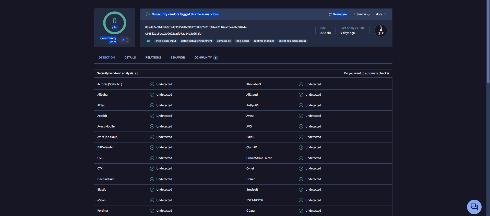
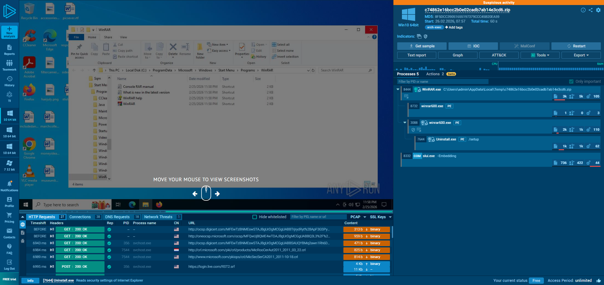
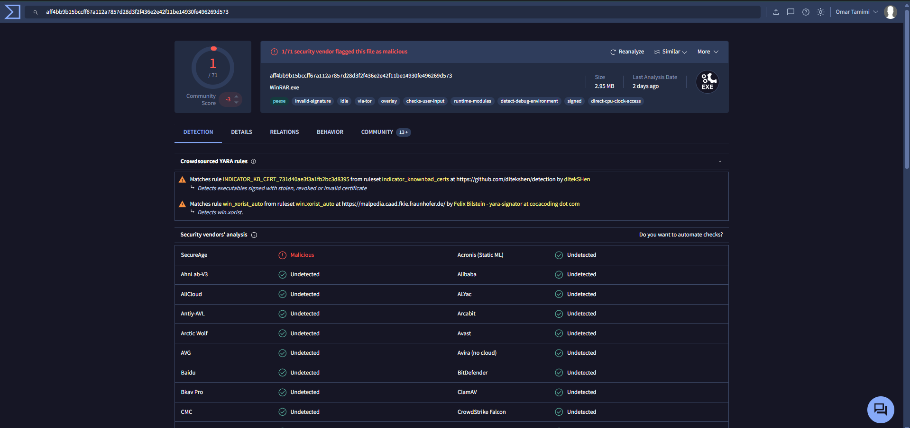
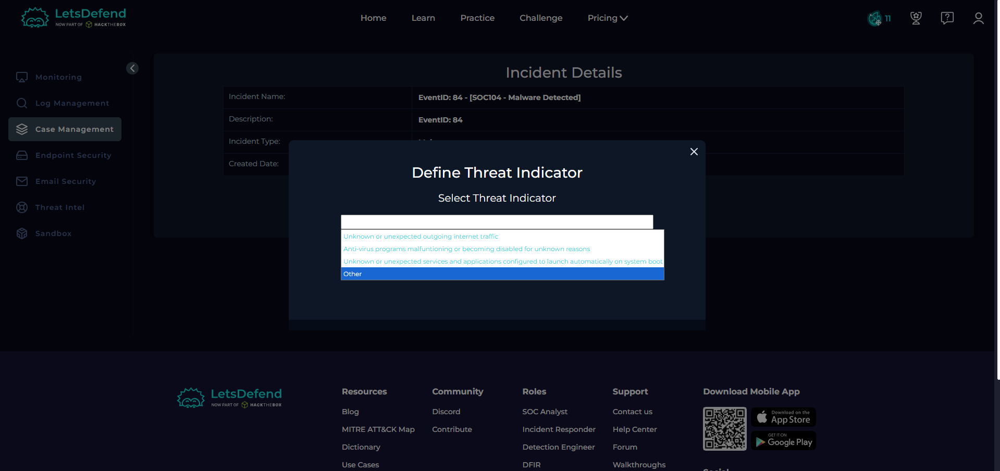
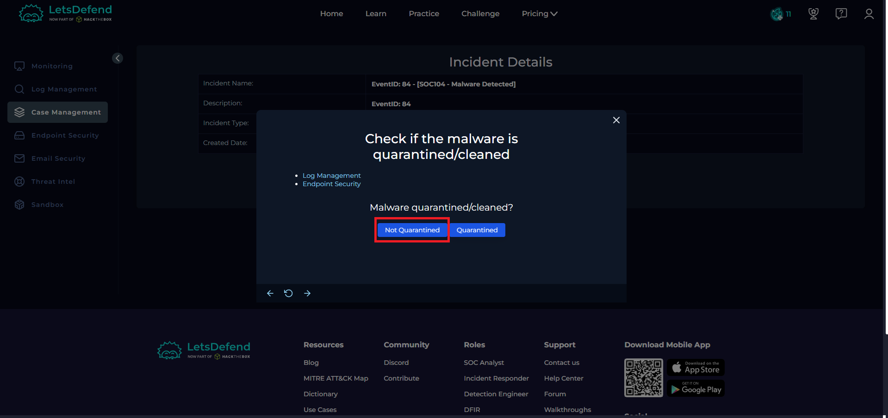
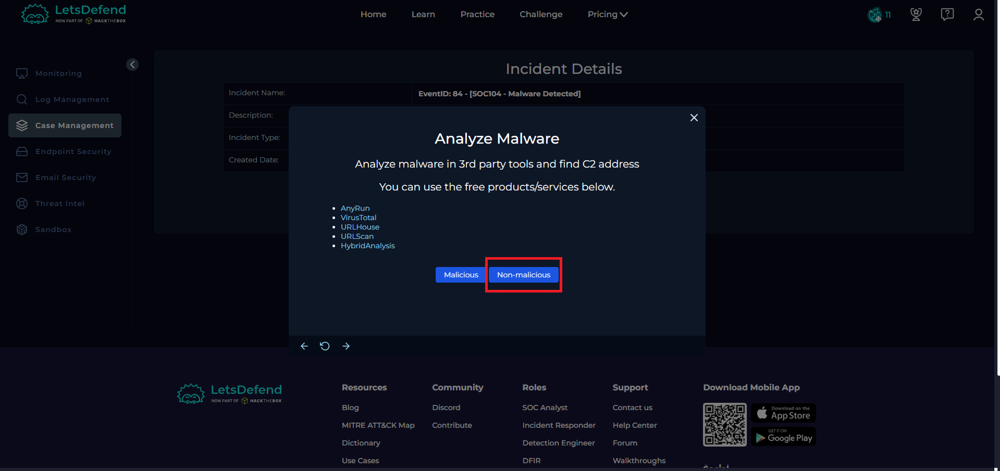
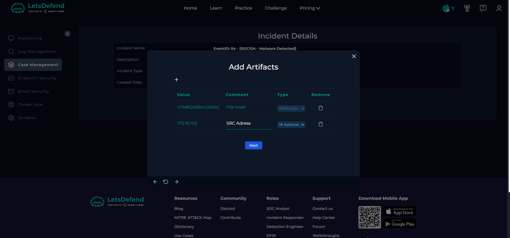
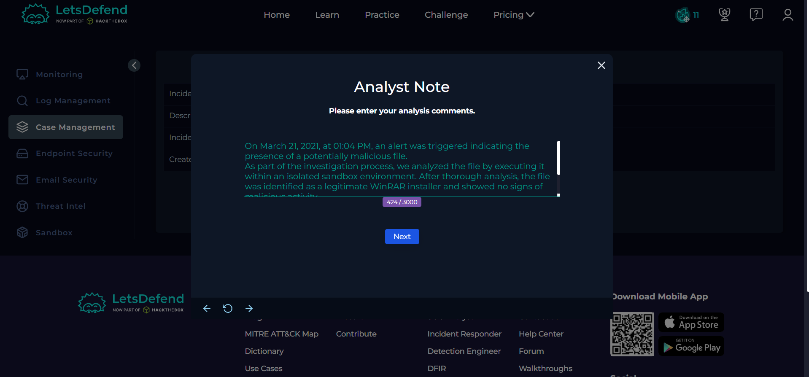

# LetsDefend SOC Walkthrough
# EventID: 84 - SOC104 - Malware Detected
```
EventID : 84
Event Time : Mar, 21, 2021, 01:04 PM
Rule : SOC104 - Malware Detected
Level : Security Analyst
Source Address : 172.16.17.5
Source Hostname : SusieHost
File Name :winrar600.exe
File Hash :c74862e16bcc2b0e02cadb7ab14e3cd6
File Size :2.95 Mb
Device Action :Allowed
File (Password:infected) :Download
```

## Lets Start 
first lets download the file 

## lets upload it into VIRUSTOTAL

it looks clean 
## Run.Any Time !!

run.any shows that this file is a Winrar Installer 
and its not suspecious !

## lets check the hash to make sure 

its clean GUYS !!

* some people say its 10/10 malicious you can check https://tria.ge/220714-3xeshacabk

## Select OTHER


## Not Quaranteined


## its WINRAR so non malicious !


## Now lets Add Artifacts


## adding our analysis comments.
On March 21, 2021, at 01:04 PM, an alert was triggered indicating the presence of a potentially malicious file.
As part of the investigation process, we analyzed the file by executing it within an isolated sandbox environment. 
After thorough analysis, the file was identified as a legitimate WinRAR installer and showed no signs of malicious activity.
Based on the findings, the alert was determined to be a false positive.



## Now lets close it with False Positive 

# END