# LetsDefend SOC Walkthrough
# EventID: 92 - SOC145 - Ransomware Detected
```
EventID : 92
Event Time : May, 23, 2021, 07:32 PM
Rule : SOC145 - Ransomware Detected
Level : Security Analyst
Source Address : 172.16.17.88
Source Hostname : MarkPRD
File Name : ab.exe
File Hash : 0b486fe0503524cfe4726a4022fa6a68
File Size : 775.50 Kb
Device Action : Allowed
File (Password:infected) : Download
```

## Let's Start

First, let's download the file.

## Now Let's Check It in VirusTotal

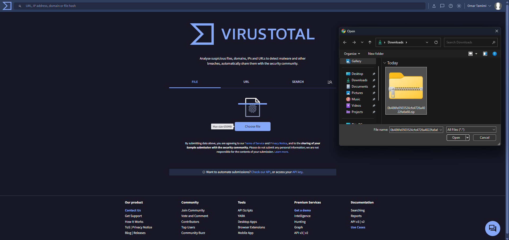

As you can see, when we upload the ZIP file, only two antivirus engines mark it as suspicious.

I think we should check it inside an isolated VirtualBox environment by extracting the file and uploading it to VirusTotal again.

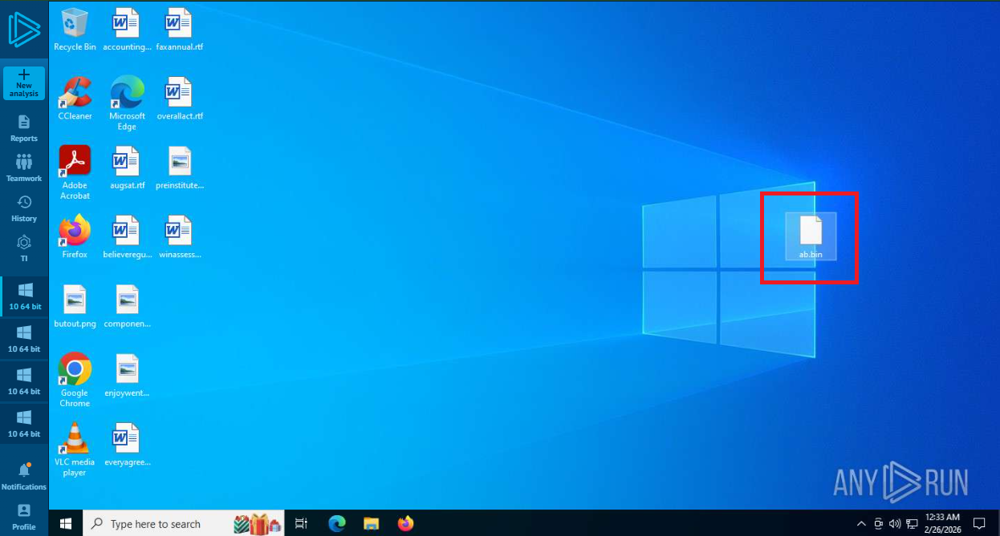

* Now let's upload the extracted file to VirusTotal.

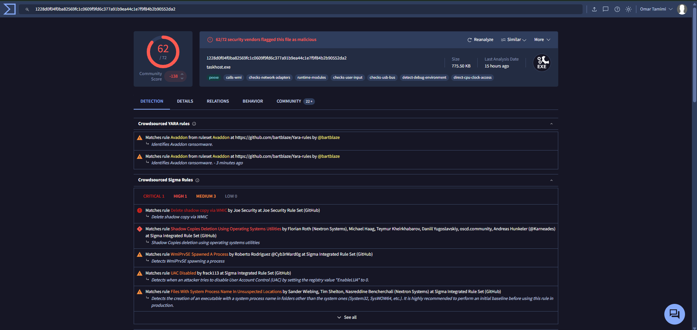


It is ransomware!

## Now Let's Start the Playbook

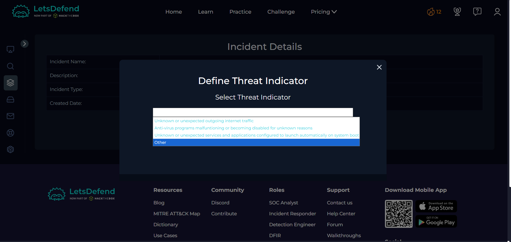

## Now Let's Check If the Malware Is Quarantined

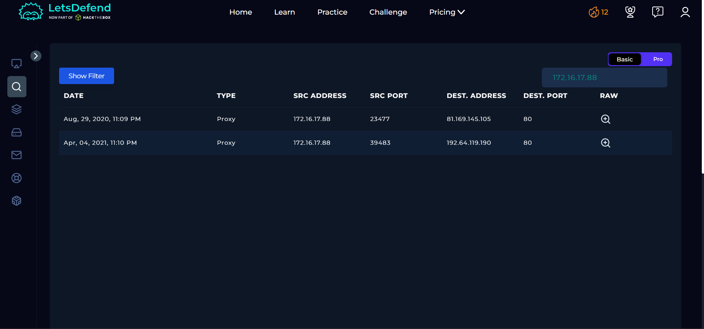

The logs do not show anything. Let’s check the endpoints.

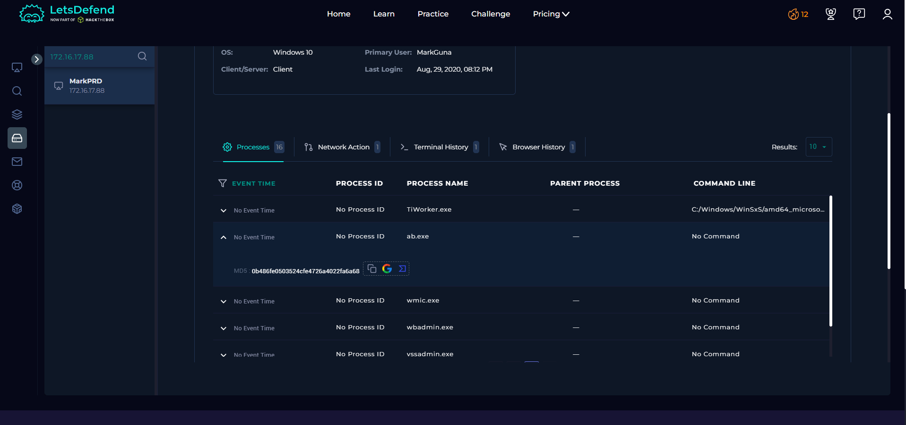

It shows that the file was executed on the MarkPRD device.

## Contain the Device

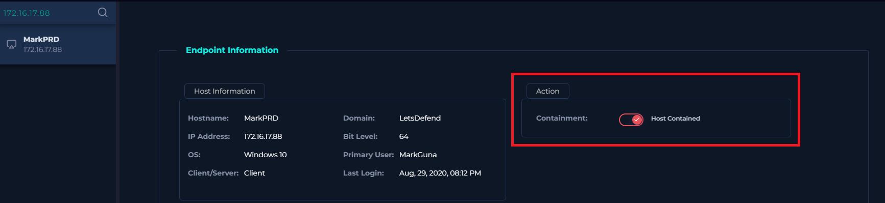

## Select Not Quarantined

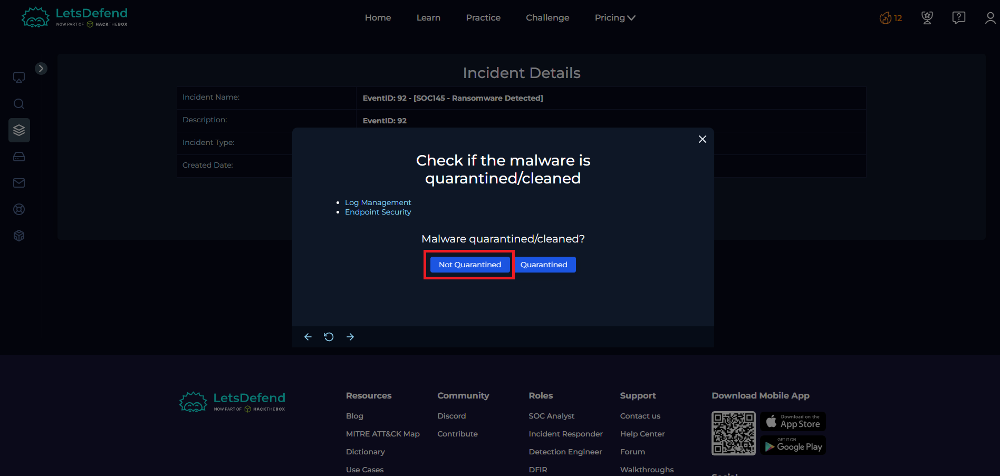

## Select Malicious

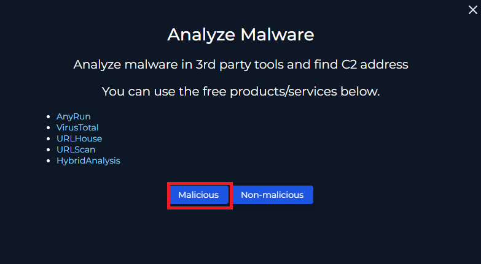

## Select Accessed

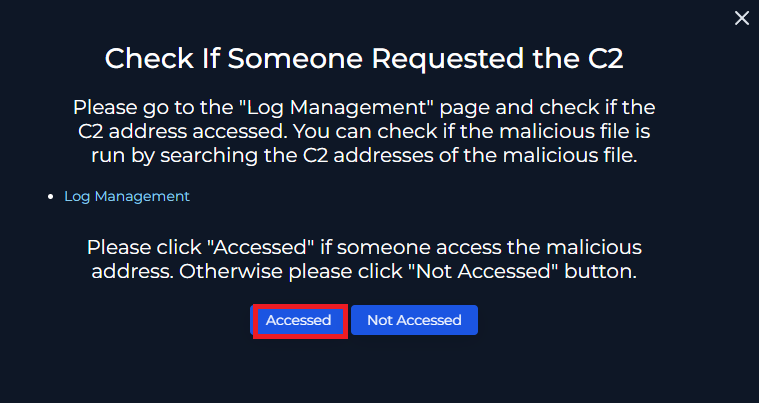

## Add Artifacts

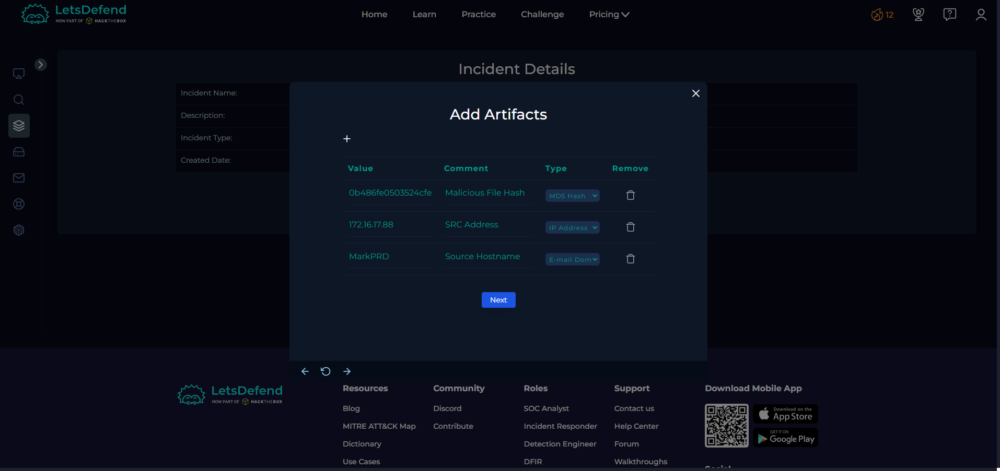

Add notes:

On May 23, 2021, at 07:32 PM, an alert was triggered indicating potential ransomware activity.

After conducting a thorough and detailed investigation, the alert was confirmed to be a true positive.  
The analysis verified that the file exhibited ransomware behavior and posed a legitimate security threat.

Immediate incident response actions were taken, including isolating and containing the affected device to prevent further spread within the network. Appropriate remediation steps were then initiated to mitigate the impact of the ransomware.

## Submit as True Positive

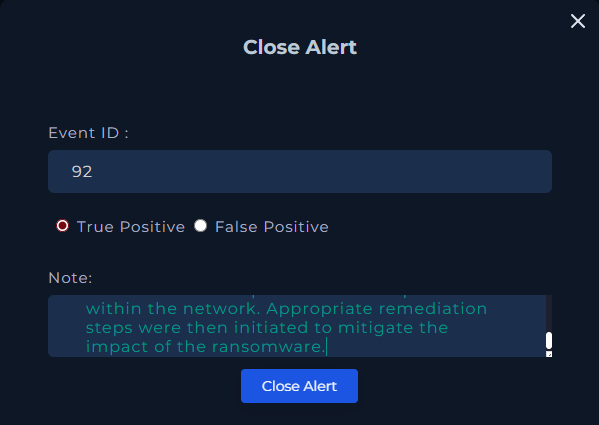

# END