# LetsDefend SOC Walkthrough - SOC282 - Phishing Alert
# EventID: 257 - SOC282 Deceptive Mail Detected 
 
## Clicking on the "Take Ownership" button

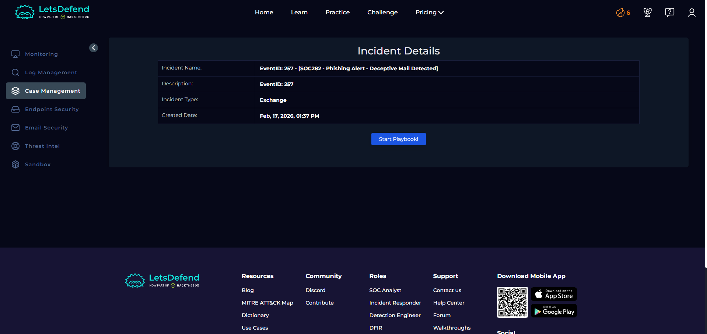

* As we can see, there is a phishing email alert. Let’s check it more closely.

## Keep the playbook in a new tab because it shows us the steps to solve this lab 

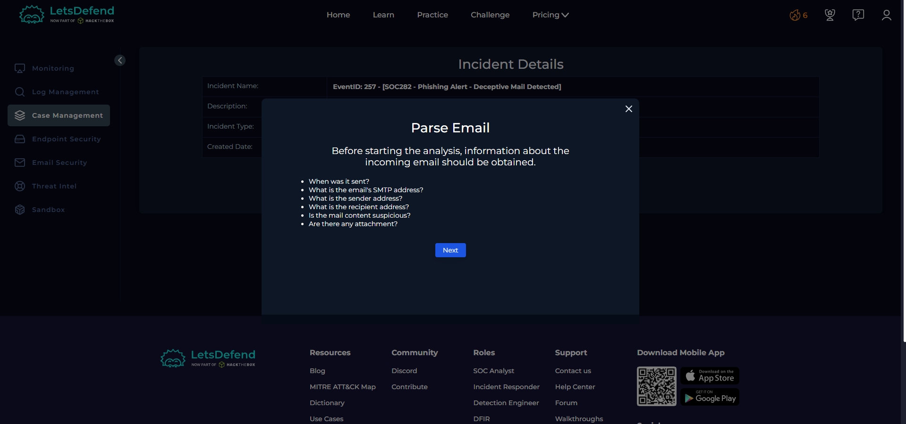

we should answer the playbook Questions 
* When was it sent?
* What is the email's SMTP address?
* What is the sender address?
* What is the recipient address?
* Is the mail content suspicious?
* Are there any attachment?

## in the alert we have the SMTP Address 

its 103.80.134.63

## Now we enter the Email Security section from the left sidebar to check the email content 

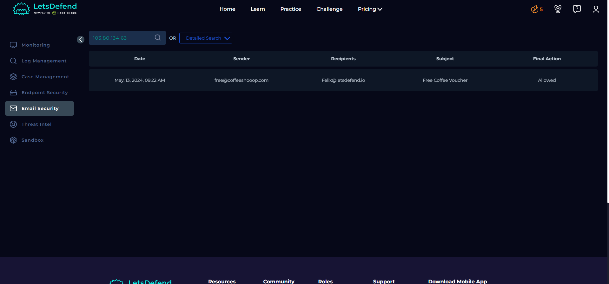
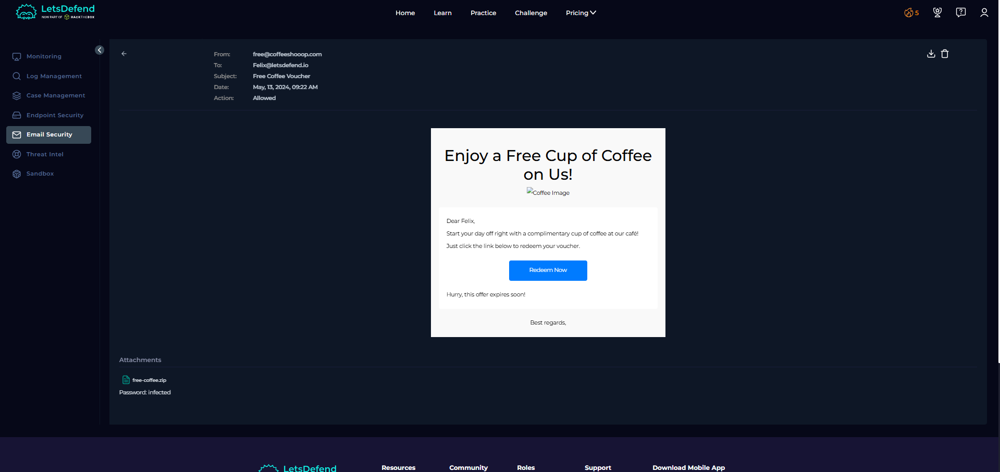

* Now we have the date the email was received and the content of the email.
* It includes an attached file, along with the sender and recipient addresses.

## Now let’s check if the attached file is malicious or not

* We download it (the password is "infected").

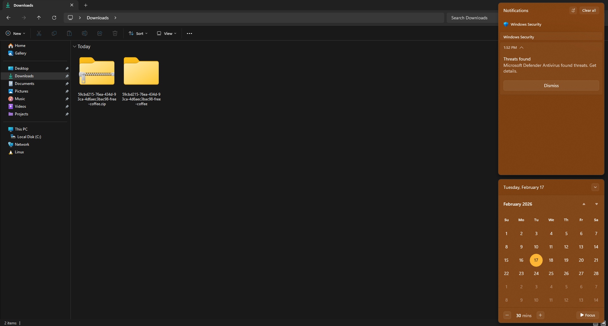

* After extracting it, Windows Defender shows that it is a malicious file.

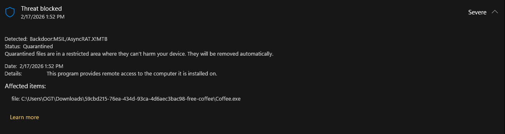

* It says the file is a backdoor virus.

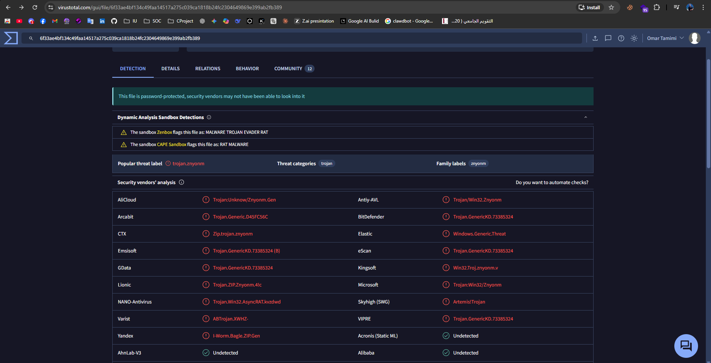
* If we upload the file (RECOMMENDED) to [virustotal](https://www.virustotal.com/) it shows that it is malicious software classified as a trojan.

## Now we have all the information we need. Let’s start closing the alert

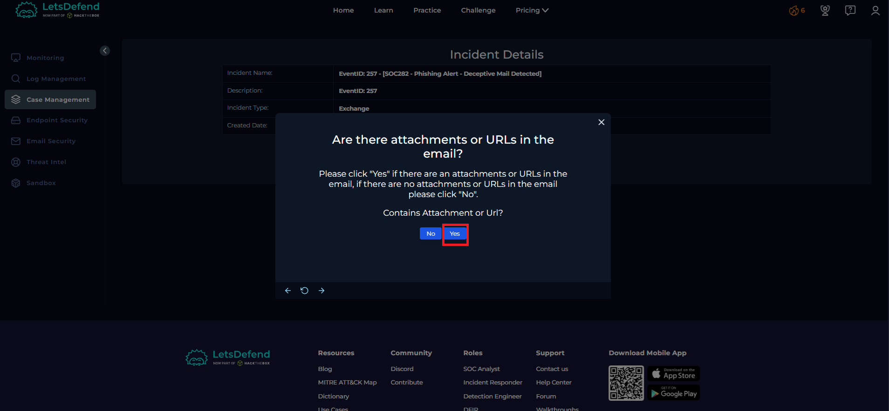
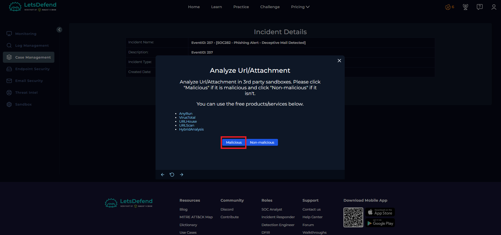
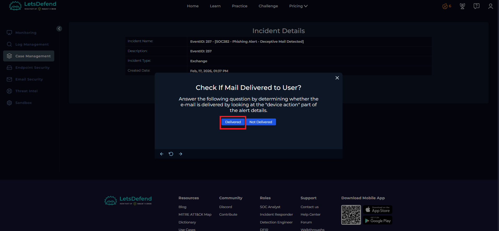

## Let’s delete the email from the customer’s mailbox 
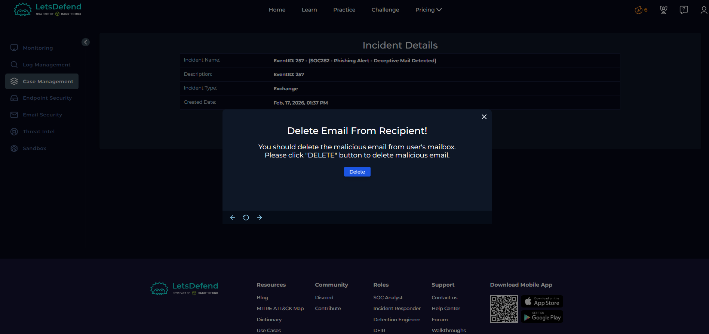

* Click the delete button in the top right corner. 

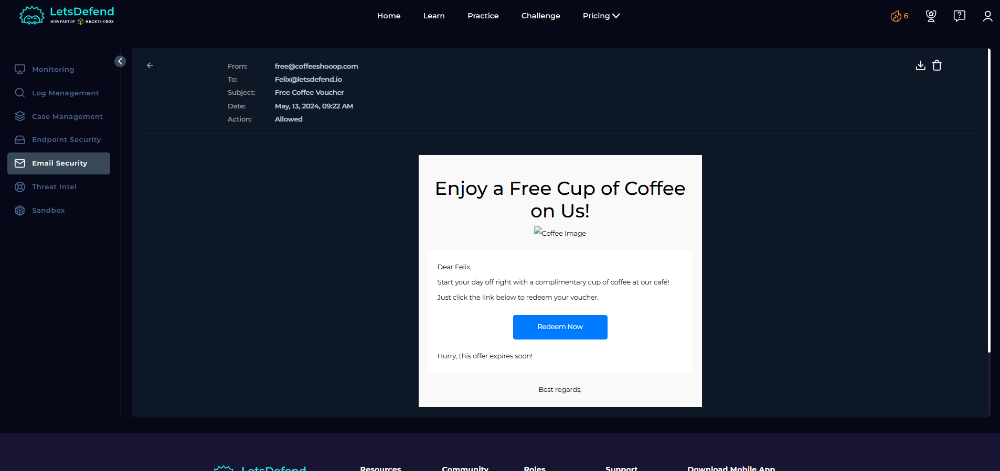

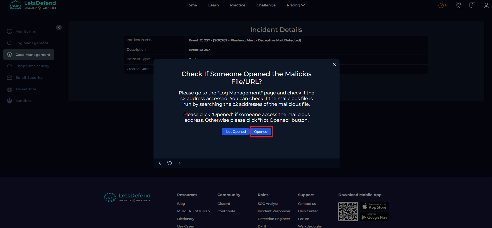

## Let’s contain the user’s machine
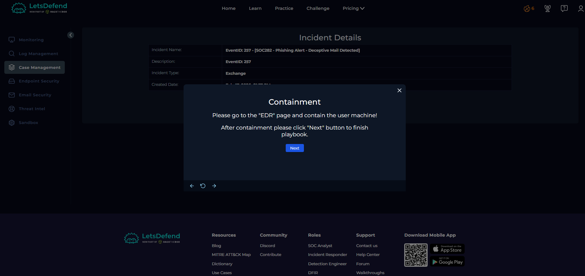

## Go to the "EDR" page and contain the user’s machine

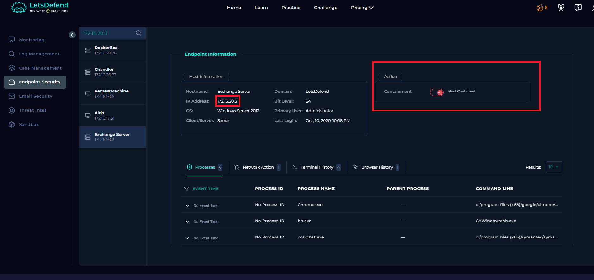

* Go to the EDR page and contain the user’s machine by searching for the victim’s address 172.16.20.3.

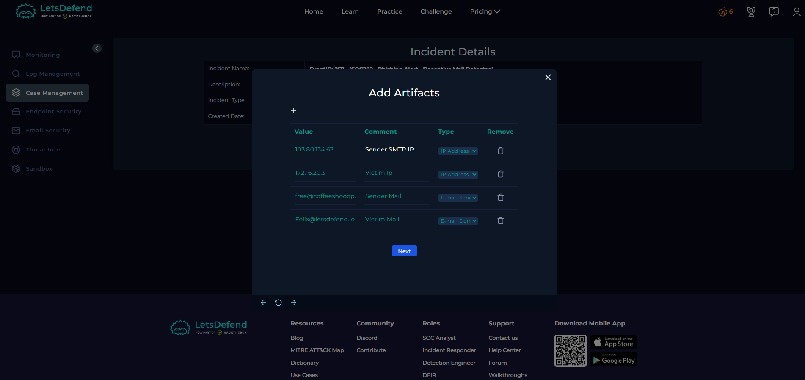

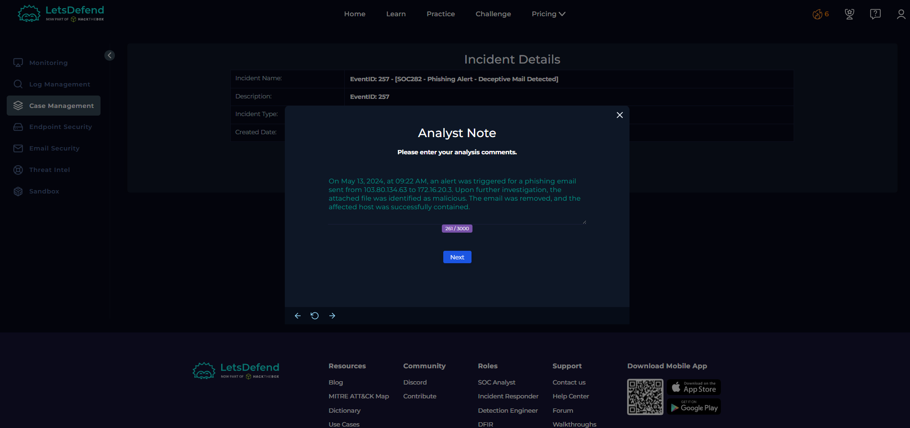

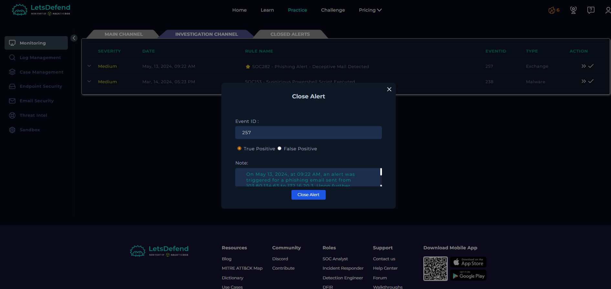

* true positive alert !!

# END . BY OMAR AL TAMIMI