# LetsDefend SOC Walkthrough
# 14 - SOC104 - Malware Detected

1. donwload Lab files 

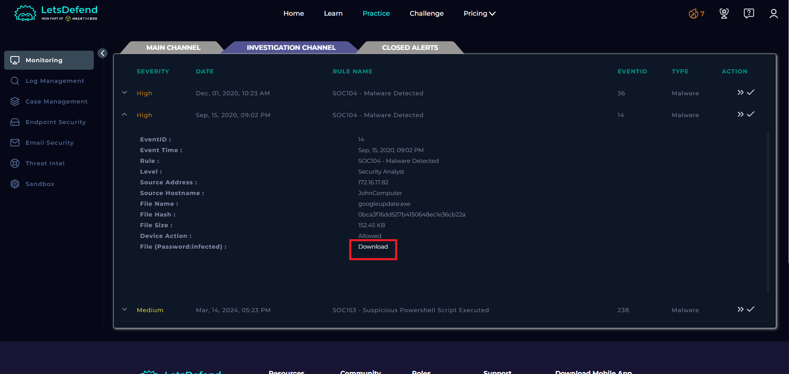

2. Open playbook and leave it in Page

 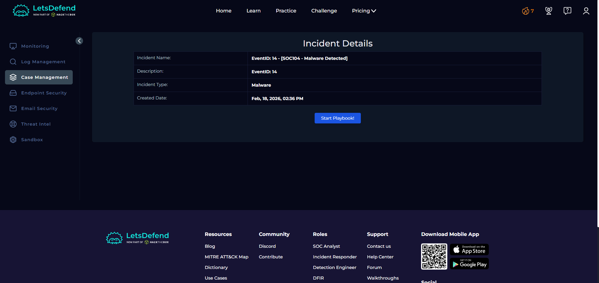

3. I started my investigation with my playbook

 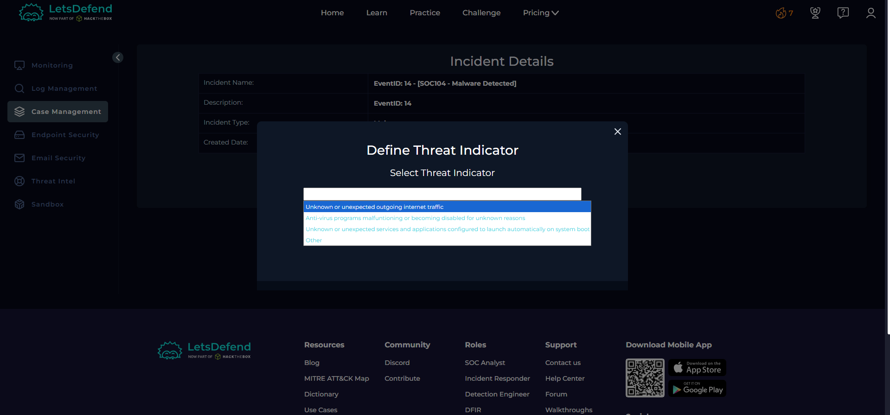

* I know this is Unknown or unexpected outgoing internet traffic, but let's also verify with a tool and skill every SOC analyst should have in their arsenal, GOOGLE(googling)
* Other options do indicate a threat at early stages, but do not indicate data exfiltration from the endpoint, which is the most suspicious thing to identify, and is serious.

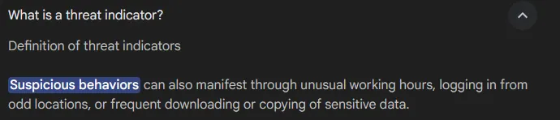

so select Unknown or unexpected outgoing internet traffic and hit NEXT Button.

4. lets check if the malware is quarantined/cleaned.

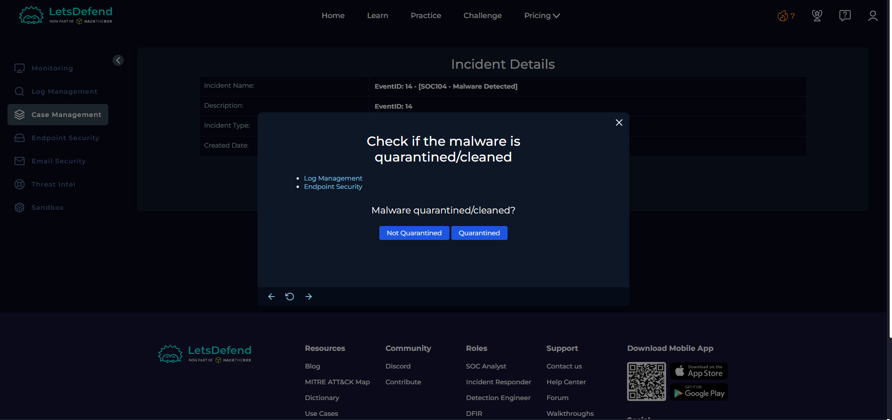

* So I check endpoint security first

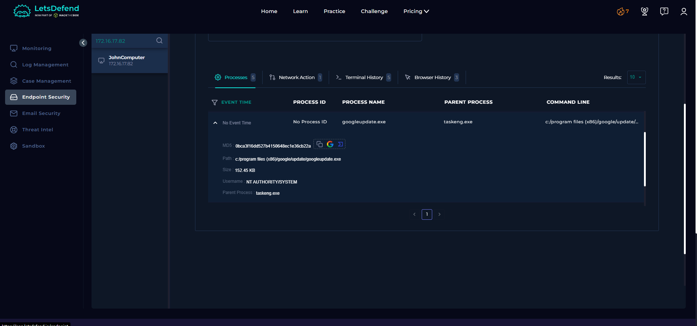

The endpoint definitely accessed the service

* So then, next was the Log data

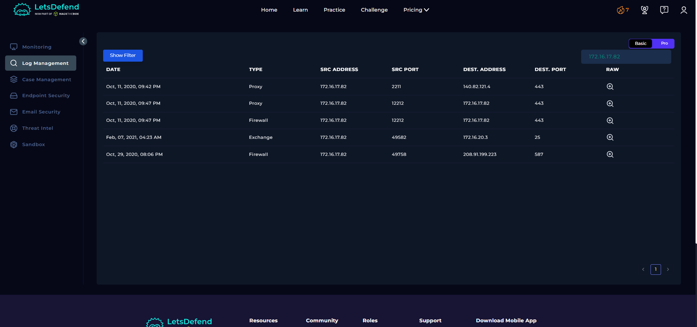

So I checked each log, but nothing on the GoogleUpdate.exe
But the endpoint accessed it, so it must not have been quarantined. Next

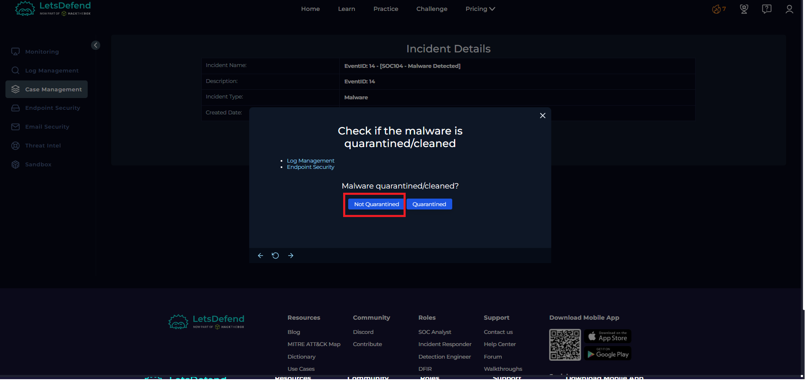

5. now lets Analyze Malware in 3rd party tools and find C2 address to check if its malicious file or not 

lets check the file using virustotal tool 

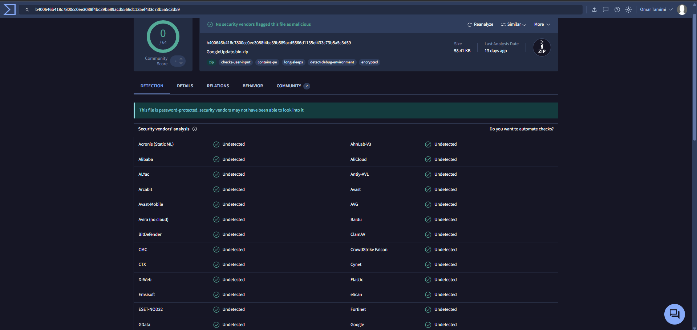

Nothing here . 

6. Now AnyRun time!!!

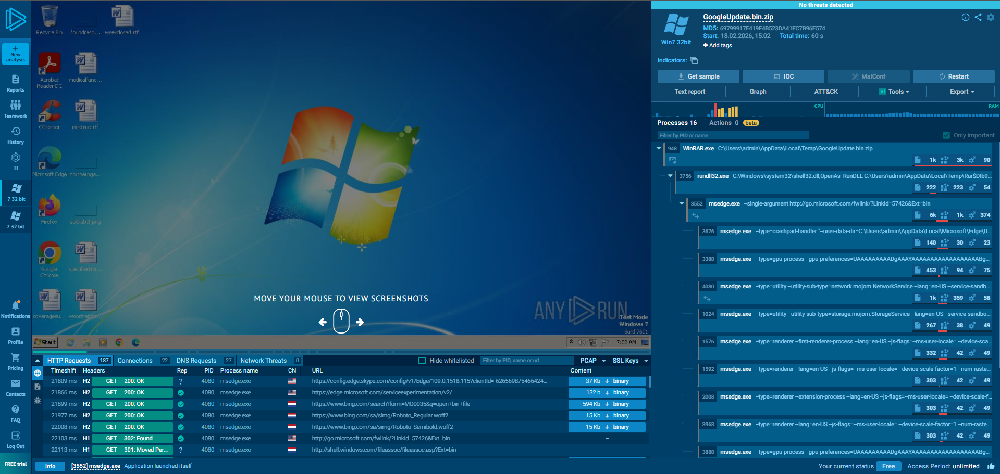

7. after checking all processes deeply its looks clean !

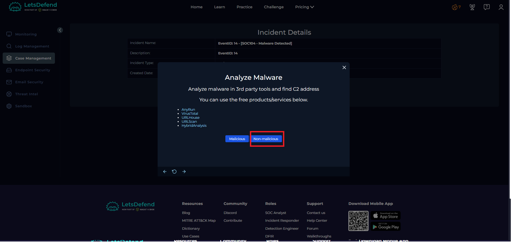

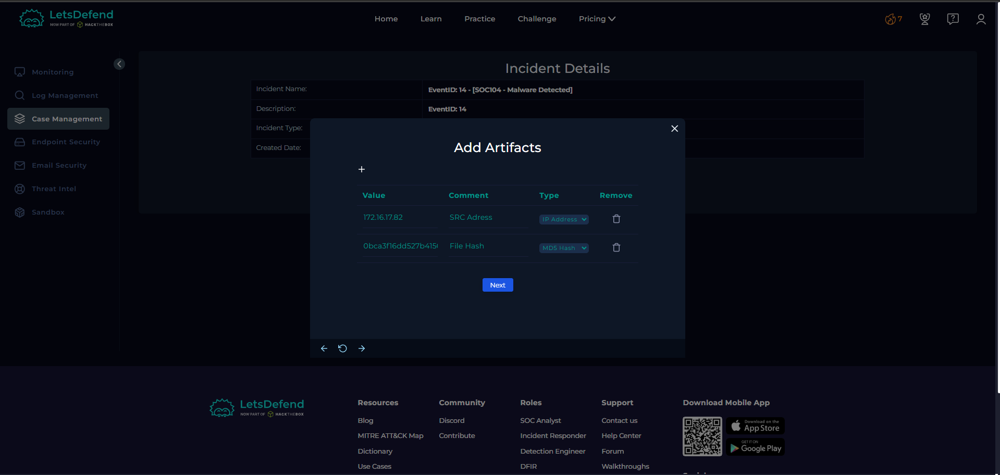

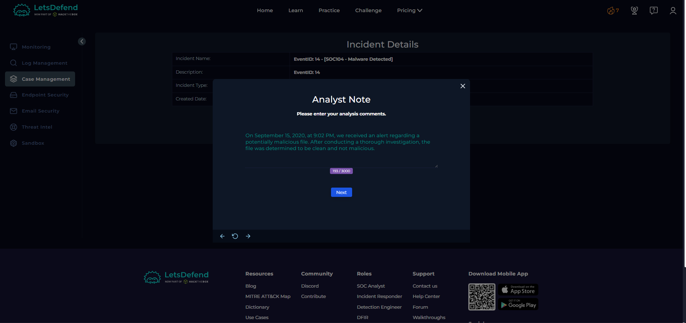

8. so its a false posetive Alert

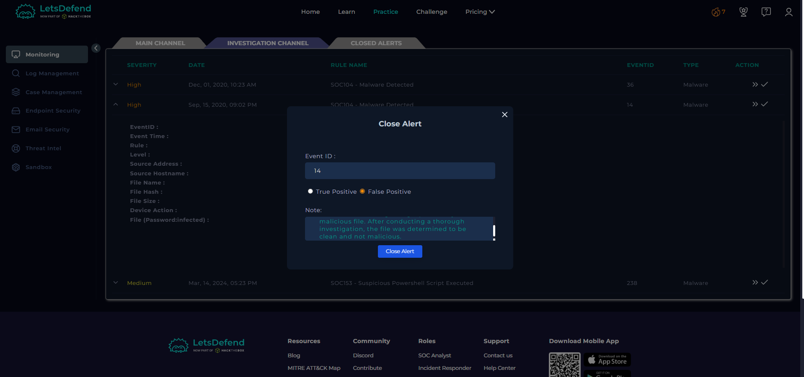
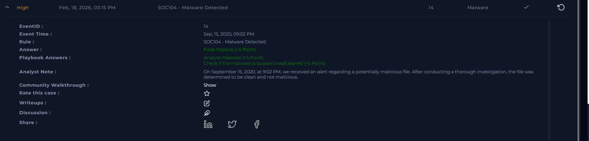

# END 