# LetsDefend SOC Walkthrough
# 36 - SOC104 - Malware Detected

1. donwload Lab files 

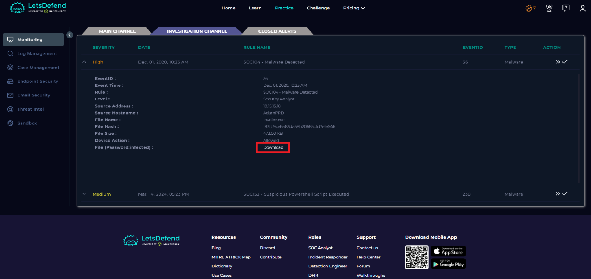

2. Open playbook and leave it in Page
select Other !

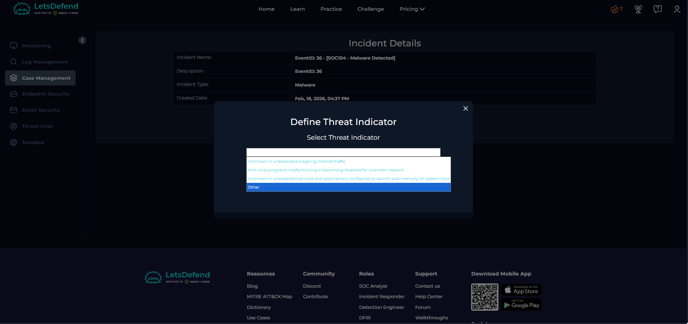

3. lets check if the malware is quarantined/cleaned. by checking Log Management and Endpoint Security

4. checking Logs of the SRC address 

Nothing Suspecious !

* Now lets check END POINTS 

after checking both LOGS AND END point i decide "Not Quaranteed"

5. its Virustotal time

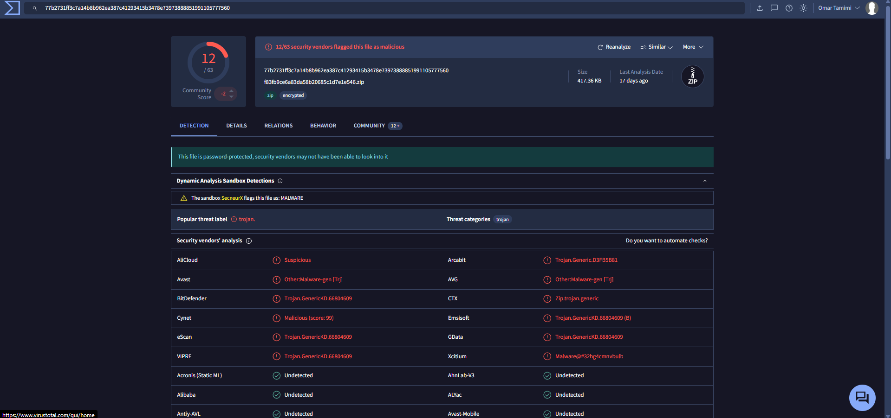
virus total indicate that this file is a Trojan "Malicious file"

6. lets move to AnyRun

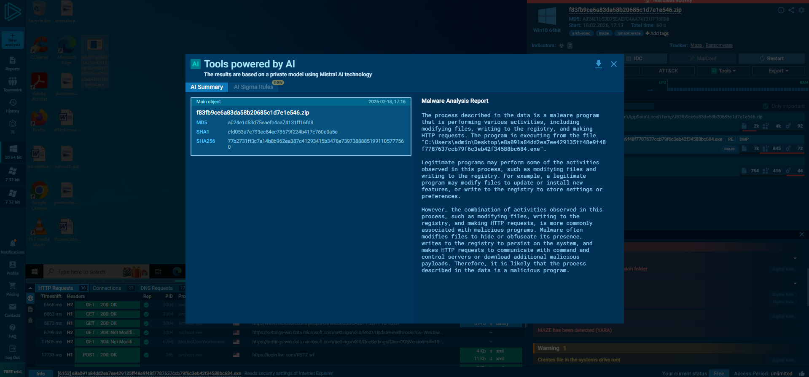
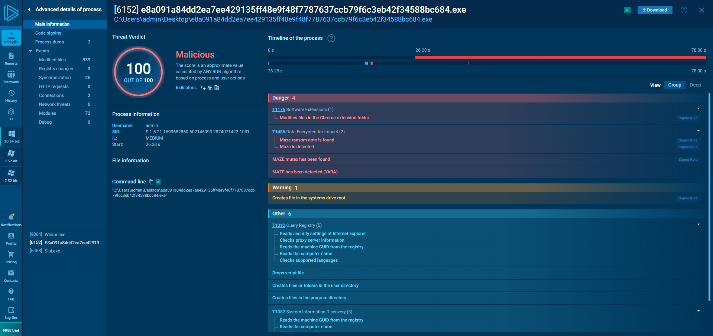

7. choise malicious

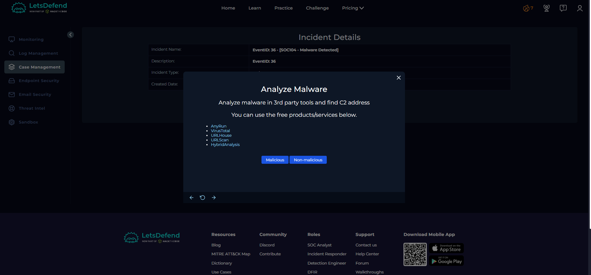

8. Check If Someone Requested the C2 using Log managment section

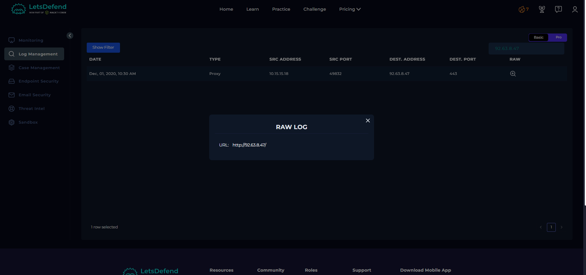

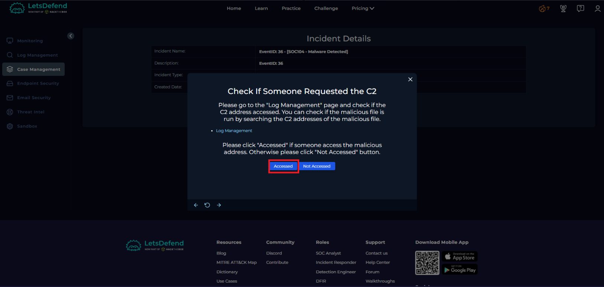

9. now lets contain the user machine! 

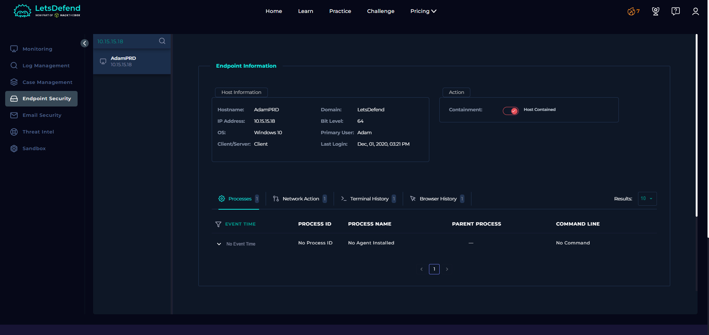

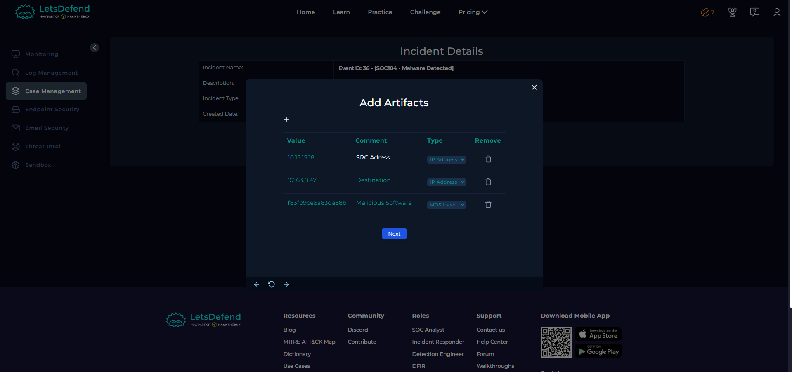

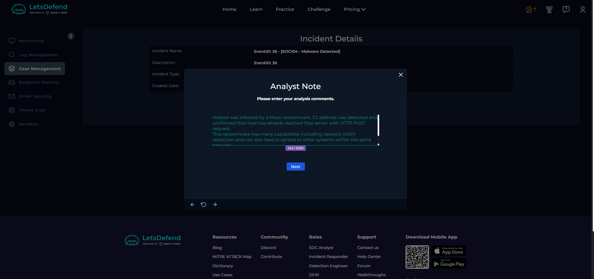

10. Choise True Positive
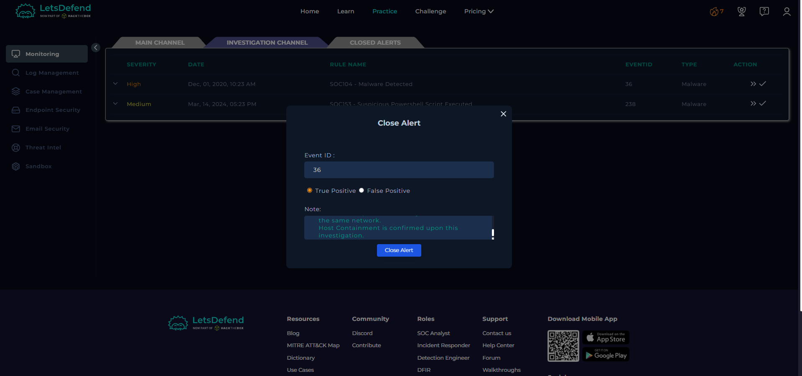 

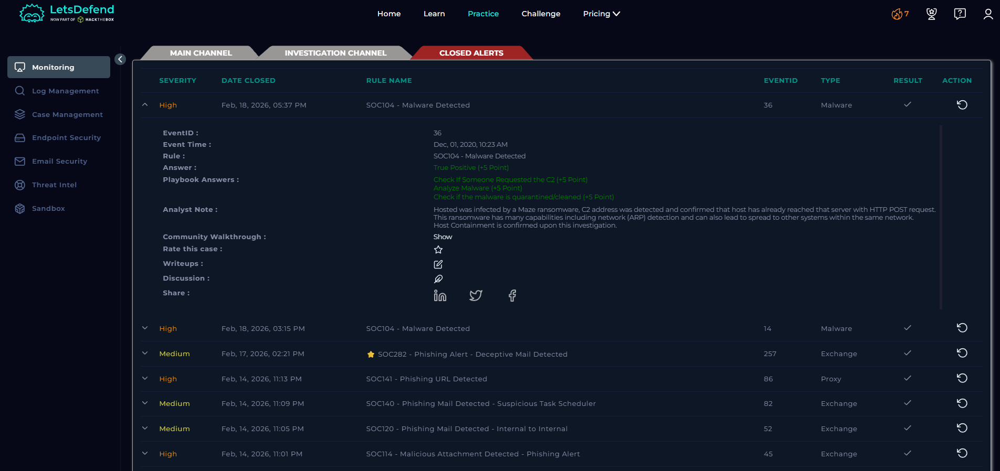

# END