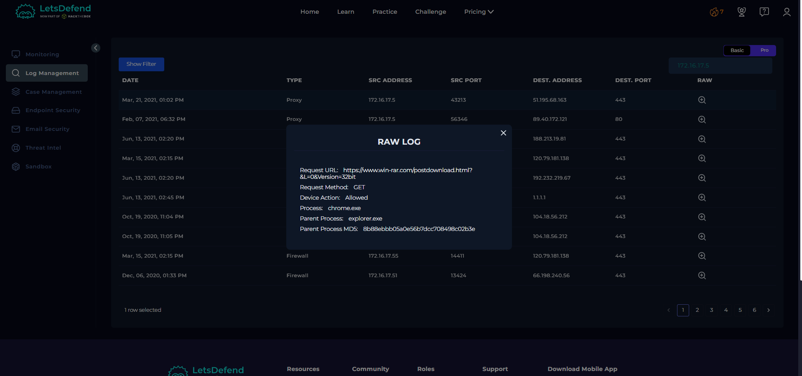
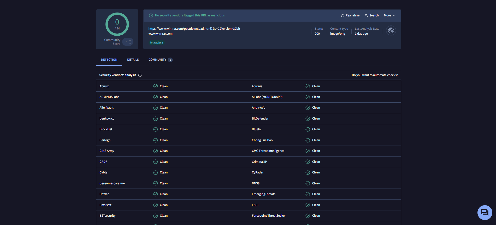
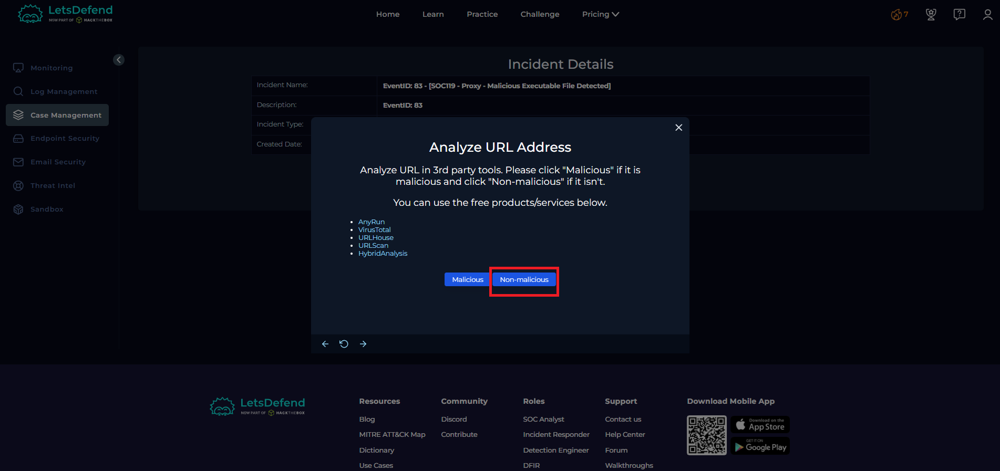
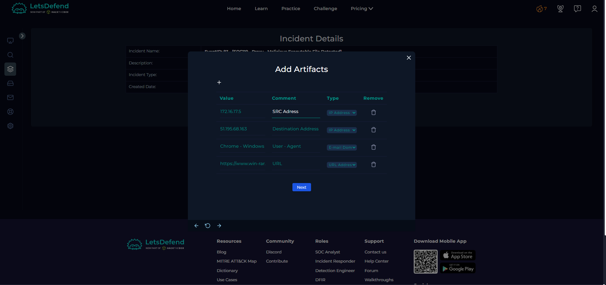
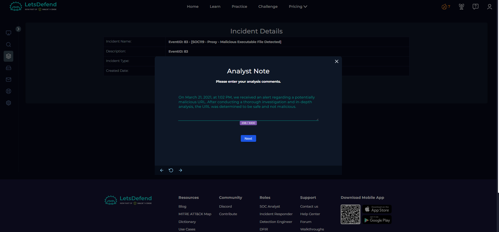
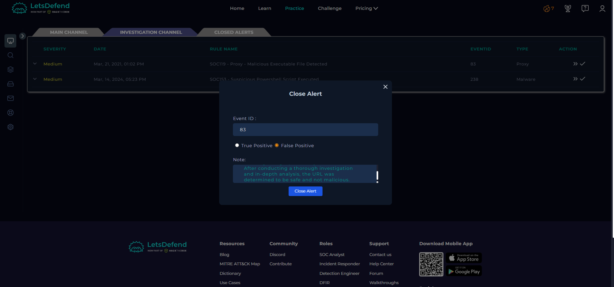
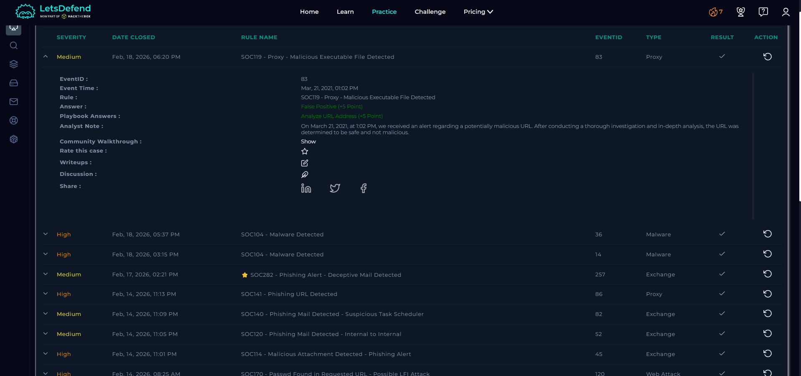

# LetsDefend SOC Walkthrough
# 83 - SOC119 - Proxy - Malicious Executable File Detected
EventID : 83
Event Time : Mar, 21, 2021, 01:02 PM
Rule : SOC119 - Proxy - Malicious Executable File Detected
Level : Security Analyst
Source Address : c
Source Hostname : SusieHost
Destination Address : 51.195.68.163
Destination Hostname : win-rar.com
Username : Susie
Request URL : https://www.win-rar.com/postdownload.html?&L=0&Version=32bit
User Agent : Chrome - Windows
Device Action : Allowed

## Lets check Log Mangement for any information 

## Check the URL 

## Select Not Malicious

 

## Select False Positive 

## END 