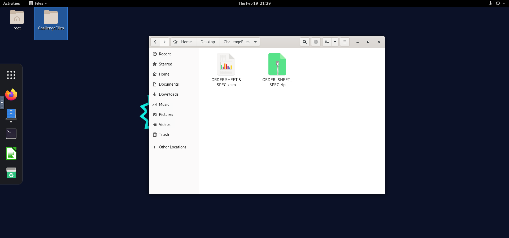
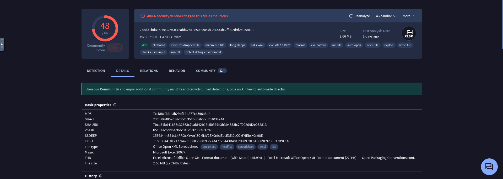
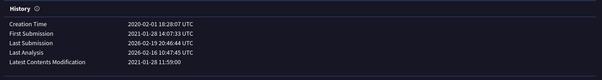
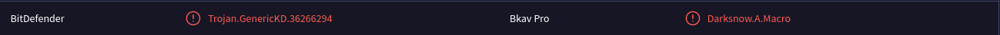
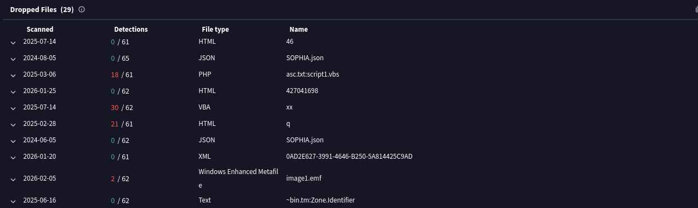
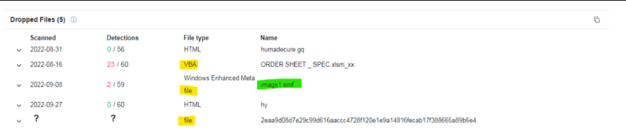
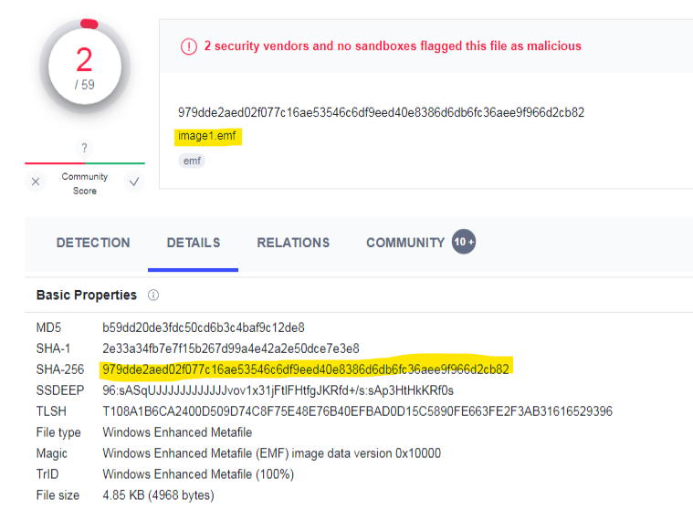
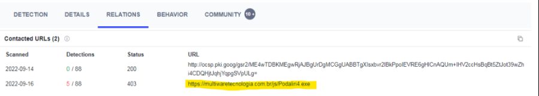

# 1) How Malware Analysis Help SOC Analysts
* Stuxnet : is a highly sophisticated, malicious computer worm discovered in 2010, designed to 
sabotage Iran's nuclear program

#### How many zero-day vulnerabilities exist in Stuxnet? (Answer should be string)
>**Answer: four**
#### Which company's industrial control systems is Stuxnet targeting?
>**Answer: Siemens**

# 2) Malware Definition and Malware Types
Malware: is a word derived from the words MALicious softWARE. It is the name given to software 
that endangers the security and integrity of systems by targeting a malicious purpose.

Malware Types:
* Backdoor: Leaving a backdoor on the device where the malware is installed, it allows the attacker 
to access the system through this backdoor. For example, by opening a network port connected to the shell, 
it enables the attacker to connect to the system through this port.
* Adware: It often comes with downloaded software, causing unwanted advertisements to be displayed on the device. 
While not all adware is harmful, some change the default search engine.
* Ransomware: It is a type of malware that has been on the world agenda for the last few years. It demands 
ransom from people by encrypting and exfiltrating all files on the device.
* Virus: It is one of the first types of malware seen in the wild. So we see that in daily life, it is often 
called a virus instead of the term malware. Viruses have a self-replicate feature. It provides persistence by 
infecting other files on the device.
* Worm: Since this type of malware spreads from infected devices to other devices, it is named worm. WannaCry, 
a worm malware exploiting MS17-010 vulnerability, caused panic around the world.
* Rootkit: It is a type of malware that disguises itself by providing access to a high level of authority on the device.
* RAT (Remote Access Trojan): It is a type of malware that provides full control over the device to the threat actor.
* Banking malware: A type of malware that targets banking applications and causes money to be stolen from the victim.
* Keylogger: A type of malware that logs pushed keys and sends this information to attacker.

#### What is the name of the first worm malware to spread on the internet?
>**ANSWER: Morris**
#### What is the vulnerability code of the vulnerability used by Wannacry?
>**ANSWER: MS17-010**
#### What is the name of the malware that was detected in December 2021, distributed through the Solarwinds Orion product and caused the hacking of many organizations such as FireEye?
>**ANSWER: SUNBURST**

# 3) What Should a Malware Analyst Know
#### What type of encryption do ransomware use?
>**ANSWER: ASymmetric**
#### What is the encryption type frequently used by ransomware-type malware?
>**ANSWER: AES**
#### What is the name of the software that compiles of the written codes?
>**ANSWER: compiler**
#### According to Wikipedia, in what year did assembly language first appear?
>**ANSWER: 1947**
#### What is the name of the software that translates machine code into assembly language?
>**ANSWER: disassembler**

# 4) Which Approach Should You Choose When Analyzing Malware?

There are 2 different approaches to analyzing malware.
1. Static Analysis : It is the approach of analyzing malicious software by reverse engineering methods without running them.
Generally, by decompile / disassemble the malware, each step that the malware will execute is analyzed, hence the behavior / capacity of the malware can be analyzed.

Your device will not be infected as you do not run malicious software in static analysis. (However, we do not recommend performing static analysis on your host device, it will be more proper to do your analysis in a virtual operating system.)

The information examined during the static analysis is as follows.
* P.E. (Portable Executable) Headers
* Imported DLL's
* Exported DLL's
* Strings in binary
* CPU Instructions

2. Dynamic Analysis : It is the approach that examines the behavior of malicious software on the system by running it.

In dynamic analysis, applications that can examine registry, file, network and process events are installed in the system, and their behavior is examined by running malicious software.

While doing dynamic analysis, you should carefully examine the following events.
* Network Connections
* File Events
* Process Events
* Registry Events

# 5) Dynamic Analysis Example Using AnyRun

* Agent Tesla is a RAT (Remote access Trojan)
* smtp.godforeu.com is a Agent Tesla malicious SMTP server address.

#### (Access AnyRun report to answer this question) What is the email address that the malware connects to the mail server to steal data?
>**ANSWER: logs@godforeu.com**

this is the password now we should decode it !
#### (Access AnyRun report to answer this question) What is the password malware use while connecting to the mail server?
>**ANSWER: O8k#Pz4sk:w_**

# 6) 29 Addresses to Analyze Malware Faster
 
* We constantly spend time analyzing malware. We have listed 29 addresses that can be useful for blue team members to use time more effectively:

<ul>
<li><a aria-label="undefined (opens in a new tab)" href="https://sandbox.anlyz.io" target="_blank" rel="noreferrer noopener" style="color:#0099FF;" >Anlyz </a></li>
<li><a aria-label="undefined (opens in a new tab)" href="https://app.any.run" target="_blank" rel="noreferrer noopener" style="color:#0099FF;" >Any.run </a></li>
<li><a href="https://valkyrie.comodo.com" style="color:#0099FF;" >Comodo Valkyrie</a></li>
<li><a href="https://sandbox.pikker.ee/" target="_blank" rel="noreferrer noopener" style="color:#0099FF;" >Cuckoo</a></li>
<li><a aria-label="undefined (opens in a new tab)" href="http://www.hybrid-analysis.com/" target="_blank" rel="noreferrer noopener" style="color:#0099FF;" >Hybrid Analysis</a></li>
<li><a aria-label="undefined (opens in a new tab)" href="https://www.intezer.com" target="_blank" rel="noreferrer noopener" style="color:#0099FF;" >Intezer Analyze</a> </li>
<li><a aria-label="undefined (opens in a new tab)" href="https://www.secondwrite.com" target="_blank" rel="noreferrer noopener" style="color:#0099FF;" >SecondWrite Malware Deepview</a> </li>
<li><a aria-label="undefined (opens in a new tab)" href="http://jevereg.amnpardaz.com/" target="_blank" rel="noreferrer noopener" style="color:#0099FF;" >Jevereg</a> </li>
<li><a aria-label="undefined (opens in a new tab)" href="http://cloud.iobit.com" target="_blank" rel="noreferrer noopener" style="color:#0099FF;" >IObit Cloud</a> </li>
<li><a aria-label="undefined (opens in a new tab)" href="http://www.binaryguard.com" target="_blank" rel="noreferrer noopener" style="color:#0099FF;" >BinaryGuard</a></li>
<li><a aria-label="undefined (opens in a new tab)" href="http://bitblaze.cs.berkeley.edu/" target="_blank" rel="noreferrer noopener" style="color:#0099FF;" >BitBlaze</a></li>
<li><a aria-label="undefined (opens in a new tab)" href="http://sanddroid.xjtu.edu.cn" target="_blank" rel="noreferrer noopener" style="color:#0099FF;" >SandDroid </a></li>
<li><a aria-label="undefined (opens in a new tab)" href="https://www.joesandbox.com/#windows" target="_blank" rel="noreferrer noopener" style="color:#0099FF;" >Joe Sandbox</a> </li>
<li><a aria-label="undefined (opens in a new tab)" href="https://amaaas.com/" target="_blank" rel="noreferrer noopener" style="color:#0099FF;" >AMAaaS</a> </li>
<li><a aria-label="undefined (opens in a new tab)" href="https://iris-h.services/pages/dashboard#/pages/dashboard" target="_blank" rel="noreferrer noopener" style="color:#0099FF;" >IRIS-H</a> </li>
<li><a aria-label="undefined (opens in a new tab)" href="https://intelligence.gatewatcher.com/" target="_blank" rel="noreferrer noopener" style="color:#0099FF;" >Gatewatcher Intelligence</a> </li>
<li><a aria-label="undefined (opens in a new tab)" href="https://tria.ge/" target="_blank" rel="noreferrer noopener" style="color:#0099FF;" >Hatching Triage</a>&nbsp;</li>
<li><a aria-label="undefined (opens in a new tab)" href="https://labs.inquest.net/dfi" target="_blank" rel="noreferrer noopener" style="color:#0099FF;" >InQuest Labs</a></li>
<li><a aria-label="undefined (opens in a new tab)" href="https://manalyzer.org/" target="_blank" rel="noreferrer noopener" style="color:#0099FF;" >Manalyzer</a> </li>
<li><a aria-label="undefined (opens in a new tab)" href="https://threatpoint.checkpoint.com/ThreatPortal/emulation" target="_blank" rel="noreferrer noopener" style="color:#0099FF;" >SandBlast Analysis</a> </li>
<li><a aria-label="undefined (opens in a new tab)" href="https://app.sndbox.com/" target="_blank" rel="noreferrer noopener" style="color:#0099FF;" >SNDBOX </a></li>
<li><a aria-label="undefined (opens in a new tab)" href="http://firmware.re/" target="_blank" rel="noreferrer noopener" style="color:#0099FF;" >firmware </a></li>
<li><a aria-label="undefined (opens in a new tab)" href="https://metadefender.opswat.com/?lang=en" target="_blank" rel="noreferrer noopener" style="color:#0099FF;" >opswat</a> </li>
<li><a aria-label="undefined (opens in a new tab)" href="http://virusade.com/" target="_blank" rel="noreferrer noopener" style="color:#0099FF;" >virusade</a> </li>
<li><a aria-label="undefined (opens in a new tab)" href="https://www.virustotal.com/gui/" target="_blank" rel="noreferrer noopener" style="color:#0099FF;" >virustotal </a></li>
<li><a aria-label="undefined (opens in a new tab)" href="https://malwareconfig.com/" target="_blank" rel="noreferrer noopener" style="color:#0099FF;" >malware config</a></li>
<li><a aria-label="undefined (opens in a new tab)" href="https://id-ransomware.malwarehunterteam.com/" target="_blank" rel="noreferrer noopener" style="color:#0099FF;" >malware hunter team</a> </li>
<li><a aria-label="undefined (opens in a new tab)" href="http://www.virscan.org" target="_blank" rel="noreferrer noopener" style="color:#0099FF;" >virscan</a>&nbsp; </li>
<li><a href="https://virusscan.jotti.org/it" target="_blank" aria-label="undefined (opens in a new tab)" rel="noreferrer noopener" style="color:#0099FF;" >jotti</a> </li>
</ul>

# Quiz 

#### What is the type of malware that is used to control the device remotely?
>**ANSWER: RAT**
#### What is the name given to programs that translate compiled code into assembly language?
>**ANSWER: Disassemblers**
#### What is the type of malware that is increasing in popularity and encrypts the files on the victim device and demands ransom?
>**ANSWER: Ransomware**
#### What is the name of the malware that has many 0day exploits and targets nuclear power plants that was on the agenda in 2010?
>**ANSWER: Stuxnet**
#### What is the malware analysis method that allows to find the command and control center in a short time?
>**ANSWER: Dynamic Analysis**
#### What is the name given to software that allows programs to be changed at runtime, to direct the flow of the code, to change the registers?
>**ANSWER: Debuggers**
#### What is the function that automatically enables macro codes to be run when the Office document is opened?
>**ANSWER: Workbook_Open()**
#### Which of the following is not a debugger?
>**ANSWER: Python**
#### Which software enables encryption of the codes of the PE file to make static analysis difficult?
>**ANSWER: Packers**
#### Which register is responsible for keeping the return values of functions in x86 architecture?
>**ANSWER: EAX**
# 100% CORRECT

# 7) Challenges Malicious Doc
Analyze malicious .doc file

File: /root/Desktop/ChallengeFiles/factura.zip
Password: infected

Writeups:
* Malware Analysis - Malicious Doc
* LetsDefend Challenge: Malicious Doc
* Analyze malicious .doc file_Letsdefend challenge #blueteam #Malware_Analysis
## Lets Solve it
1. First connect to the Lab Environment

2. Lets Analyse it on VirusTotal (static Analysis)

* results before Unzip

* results after Unzip

* so The file is identified as an exploit document capable of executing dropped files and leveraging known Office vulnerabilities.
* We got the type of exploit and the relevant Exploit CVE code.

* The file downloaded from the remote server is: **jan2.exe**

3. Lets More to Any.run (Dynamic malware analysis)

* The communication observed in the sandbox is: 185.36.74.48:80

4. In VirusTotal ,when clicked on relation tab’s ,dropped file’s SHA256 hash we got , several files are dropped.

* if We Check the hash Closely we found that The primary malicious dropped file identified for this challenge is: **aro.exe**

#### What type of exploit is running as a result of the relevant file running on the victim machine?
>**ANSWER: Rtf.Exploit**
#### What is the relevant Exploit CVE code obtained as a result of the analysis?
>**ANSWER: CVE-2017-11882**
#### What is the name of the malicious software downloaded from the internet as a result of the file running?
>**ANSWER: jan2.exe**
#### What is the IP address and port information it communicates with?
>**ANSWER: 185.36.74.48:80**
#### What is the exe name it drops to disk after it runs?
>**ANSWER: aro.exe**

# 8) Challenges Malicious VBA
* NOTE: .VB files are text-based source code files written in the Visual Basic (VB) programming language, primarily used within the Microsoft .NET 
framework for developing Windows applications. 

One of the employees has received a suspicious document attached in the invoice email.
They sent you the file to investigate. You managed to extract some strings from the VBA Macro document. 
Can you refer to CyberChef and decode the suspicious strings?

Please, open the document in Notepad++ for security reasons unless you are running the file in an isolated sandbox.

Malicious Macro: /root/Desktop/ChallengeFiles/invoice.vb

This challenge prepared by @RussianPanda
Writeups:
* Malware Analysis - Malicious VBA
* Let's Defend Malicious VBA

## Lets Solve it
1. First connect to the Lab Environment

2. lets open it with notepad 

3. Now lets check the Text in Cyberchef 

* Look for human unreadable strings in the file. Try with the encoded strings in line 10:

we found the URL 

4. After that, try the encoded strings present in next line 11:

we found the filename 

5. Going back to the VBA file, try to decode the next encoded strings present in line 13:

we found the method is it used to establish an HTTP connection

6. try to decode the next encoded strings present in line 15:

HEHEHEHE user-agent is here !!!

7. now lets try to decode the next encoded strings present in line 19:

8. to find the object the attacker uses for WMI execution, try to decode the next encoded strings present in lines 69–73:

* It looks correct, but there are some repeated strings

we found it !! 

#### The document initiates the download of a payload after the execution, can you tell what website is hosting it?
>**ANSWER: https://tinyurl.com/g2z2gh6f**
#### What is the filename of the payload (include the extension)?
>**ANSWER: dropped.exe**
#### What method is it using to establish an HTTP connection between files on the malicious web server?
>**ANSWER: MSXML2.ServerXMLHTTP**
#### What user-agent string is it using?
>**ANSWER: Mozilla/4.0 (compatible; MSIE 6.0; Windows NT 5.0)**
#### What object does the attacker use to be able to read or write text and binary files?
>**ANSWER: ADODB.Stream**
#### What is the object the attacker uses for WMI execution? Possibly they are using this to hide the suspicious application running in the background.
>**ANSWER: winmgmts:\\.\root\cimv2:Win32_Process**

# 9) Challenges Remote Working
* NOTE : An .XLS file is a legacy spreadsheet file format used by Microsoft Excel 97-2003

Analysis XLS File

File link: /root/Desktop/ChallengeFiles/ORDER_SHEET_SPEC.zip
Password: infected

## Lets Solve it

1. First connect to the Lab Environment

2.its virustotal time !!

3. we found the Creation date ar History section and the name

* its 2020-02-01 18:28:07

4. The dropped files can seen on the relations tab at Virustotal.

* 29 files

5. Find the file that contains the .emf extension

click on it , it cotains the SHA-256 hash 

979dde2aed02f077c16ae53546c6df9eed40e8386d6db6fc36aee9f966d2cb82

6. to get the Contacted URLs go to relations 

its https://multiwaretecnologia.com.br/js/Podaliri4.exe

#### What is the date the file was created? (UTC) Answer Format: YYYY-MM-DD HH:MM:SS
>**ANSWER: 2020-02-01 18:28:07**
#### With what name is the file detected by Bitdefender antivirus?
>**ANSWER: Trojan.GenericKD.36266294**
#### How many files are dropped on the disk?
>**ANSWER: 29**
#### What is the sha-256 hash of the file with emf extension it drops?
>**ANSWER: 979dde2aed02f077c16ae53546c6df9eed40e8386d6db6fc36aee9f966d2cb82**
#### What is the exact url to which the relevant file goes to download spyware?
>**ANSWER: https://multiwaretecnologia.com.br/js/Podaliri4.exe**

# 100 CORRECT 
