# LECTURE9: Dynamic Malware Analysis
# 1) What is Dynamic Malware Analysis?
Dynamic malware analysis method is an analysis method in which malware is run and examined in 
secure environments. In this method, it is aimed to analyze the behavior of the malicious software 
by examining the activities like network, and file, etc. in secure environments.

* Some of the advantages of the dynamic analysis method are;

1. It produces much faster results than the static analysis method,
2. You can perform automated analysis with sandboxes,
3. It is an analysis method that requires less technical knowledge than static analysis, so beginners can learn easily.

* Some of the disadvantages of the dynamic analysis method are;

1. You cannot determine the full malware capacity, as the behavior of the malware may vary from different systems.
2. You cannot usually analyze advanced malware with the dynamic analysis method alone, in these cases you may need to use both dynamic and static analysis methods together.
>**ANSWER: CHECK**

# 2) Importance of Dynamic Malware Analysis for SOC Analysts

>**ANSWER: CHECK**

# 3) Which tools and software do we need?

## Virtualization Software
Some of the frequently used virtualization software are as follows;
* VMware Workstation
* VMware Fusion
* Oracle Virtualbox

**An ideal isolated dynamic analysis environment consists of a completely separate physical device and a separate network. However, setting up this complex environment is both very costly and it is not necessary to begin with.**

## Utility Softwares
* Microsoft Office
* Adobe Reader
* Browser (Chrome, Firefox etc.)
* WinRAR
* Text Editors (Notepad++, Sublime Text etc.)

## Debuggers
Debuggers are software that are generally used by programmers to test the codes and catch the errors. 
Debuggers help to see the instructions of a process and change the flow of the program.

    FOR EXAMPLE : you want to analyze a malware that does not work when the device name is not “John”. 
    With the help of the Debugger, you can disable this control by making changes to the codes in which this control is made, 
    and ensure that the malware continues to run.

Some debuggers that are frequently preferred by malware analysts are as follows.
* Ollydbg: a popular 32-bit assembler-level debugging tool for Microsoft Windows
* X64dbg:  can debug both x64 and x32 applications
* Windbg: is a debugger that can be used to analyze crash dumps
* Radare2:(also known as r2) is a comprehensive, open-source framework for reverse engineering and binary analysis

## Network Monitoring Tools
We need some software to detect the network activities of the malware. Some of them are as follows.
* Wireshark
* Fiddler
* Burp Suite

## Process Monitoring Tools

    Windows already comes with a process monitoring tool called “Task Manager”. However, other process monitoring tools are more useful in terms of usage and features for malware analysis.
You can install the following process monitoring tools in the virtual operating system we will create for dynamic malware analysis.
* Process Hacker
* Process Explorer (SysInternals)
* Procmon (SysInternals)

## File Activity Monitoring Tools
You can use the following tools to see file activities.

* Sysmon
* SysInternal Tools
* CFF Explorer
* PEView
* TriDNet
* BinText
* PEiD
* Regshot
* HashMyFiles

#### Which of the following tools is different from the others in terms of its function?
>**ANSWER: Procmon**
#### What activities cannot be viewed with Procmon?
>**ANSWER: Syscalls**
#### Which of the following tools does not provide hash information of files?
>**ANSWER: Procmon**


# 4) Creating Virtual Machine
#### What is the Network configuration that provides Internet access through the network interface of the host operating system?
>**ANSWER: NAT**
#### What name should a registry key be created to disable the ASLR feature?
>**ANSWER: MoveImages**

# 5) What Should We Pay Attention to when we conduct a Dynamic Analysis?

## 1. Process Activities

```
When the malware is run, it creates a process of its own like other applications.
Before following other activities, we must detect the processes belonging to the malware.

When examining a process, special attention should be paid to information such as whether it 
creates a new child process, the DLLs it imports, and which user it is run by.

```
* use application called **Process Hacker** to examine processes.

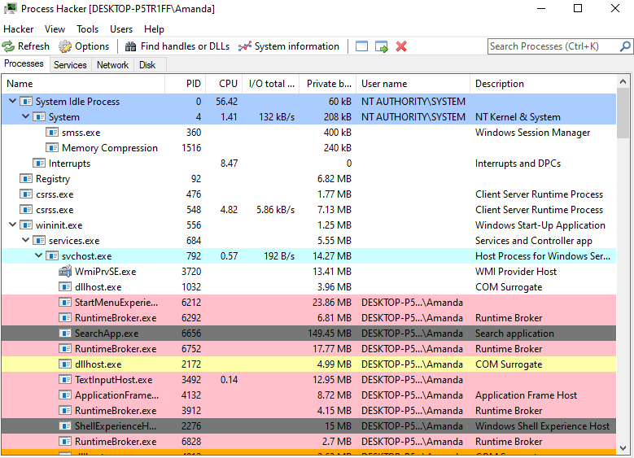

## 2. Network Activities

```
Malware often establish a network connection to download the second payload, to communicate 
with command and control (c2), to jump to other devices in the network, to steal data.

Wireshark is a software that can meet all your needs for analyzing network activities.

malware communicates especially over the HTTP protocol (Malware mostly communicates via protocols 
such as HTTP, SMTP).
```

## 3. Registry Activities

```
registries are hierarchical databases that are used for data storage in Windows operating systems. 
It is used by attackers for purposes such as stealing data and ensuring persistence.

```
* By using the application called **Regshot**, you can detect the changes that the malware has made on the Registries.
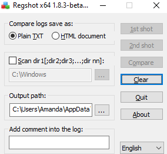

    HOW ITS WORKS : Before executing the malware, you can run Regshot and click the "1st shot" 
    button to let Regshot collect existing registries. Then, you should press the "2nd shot" button 
    to get a new shot after running the malware and allowing some time to show activity. 
    You can see the differences between these two shots of Regshot by pressing the “Compare” button.


## 4. File Activities 

```
Malware often copies itself to the Temp directory. For this reason, you should pay special 
attention to the activities performed on this directory. %TEMP%

malware also copies itself to the Startup directory, which contains applications that will run 
automatically when the operating system starts. You should pay special attention to the activities
performed in these directories. shell:startup | shell:common startup


```

#### Which tool should be used to detect network activities?
>**ANSWER: Fiddler**
#### What command should be typed in the "Run" application to switch to the “temp folder”.
>**ANSWER: %temp%**

# 6) Dynamic Malware Analysis Example #1


## Lab 

1. Lets Connect the Windows 10 virtual machine.


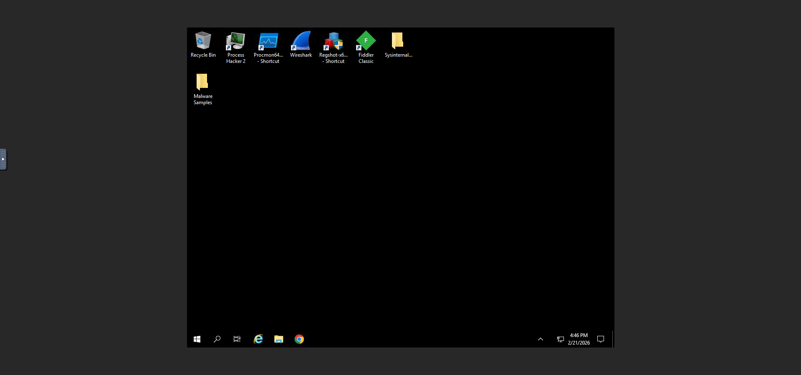

2. Running Process Hacker, Procmon64, Wireshark, and Fiddler tools available on the desktop before clicking on Malware file.

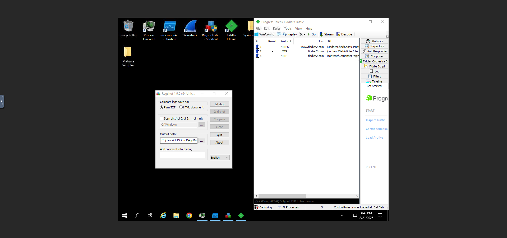
lets start analysing.

3. Select Ethernet in Wirshark

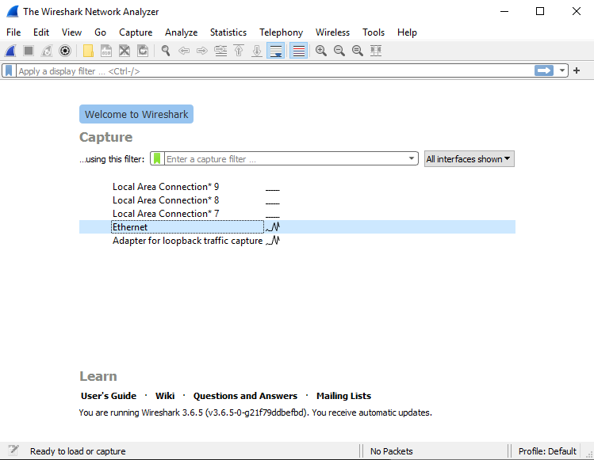

4. Now Open “Malware Samples” folder and Click “law.exe.zip” file and execute the malware, Enter the password : “infected”

5. Now lets open the Process Hacker and Procmon !

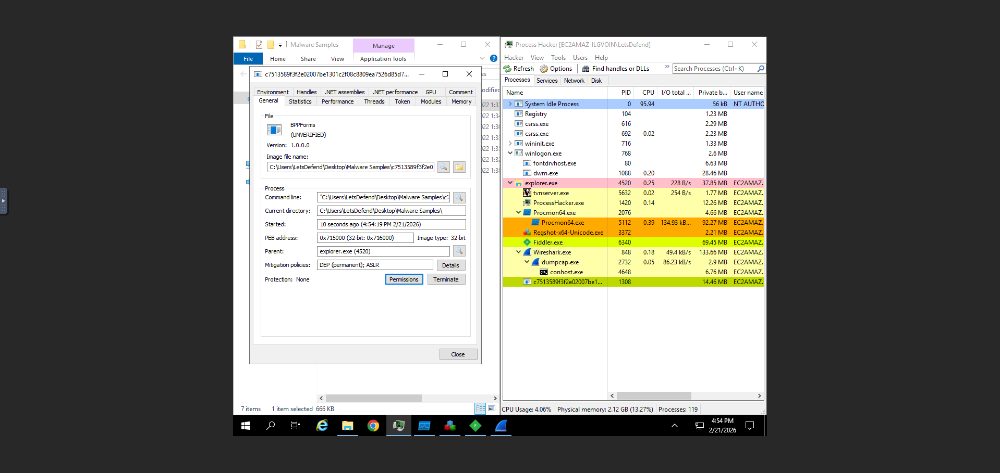

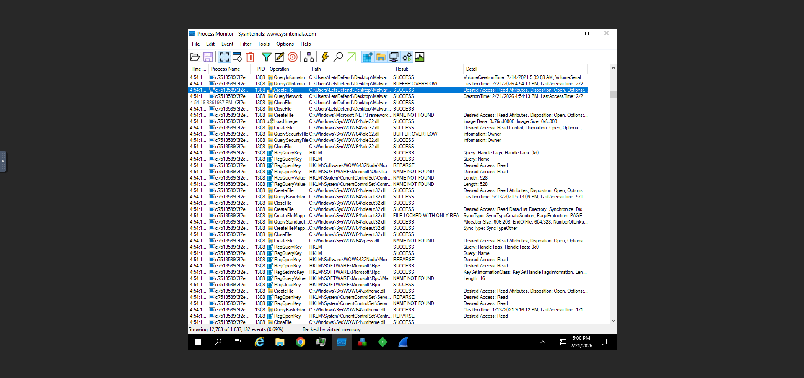
as we see that Malware reads system files, creates files, and makes changes to the registry very quickly.

6. Lets check network traffic to capture the domain name 
Open the Wireshark and filter as SMTP. Then look at the TCP Stream.

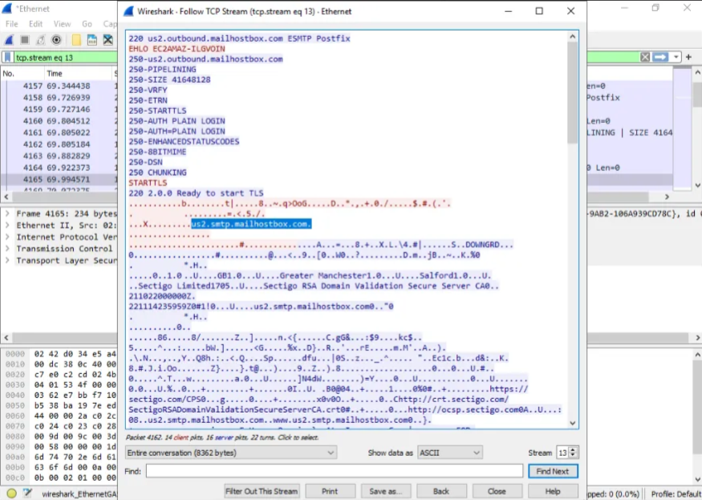
we capture the domain "us2.smtp.mailhostbox.com" and the port "587"

7. to get the name of the executable file that the malicious application writes to the AppData directory
let check Procmon

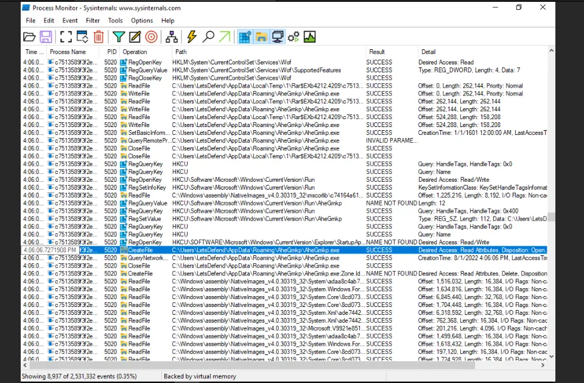

8. to get Registry Key does the malware use to ensure persistence?
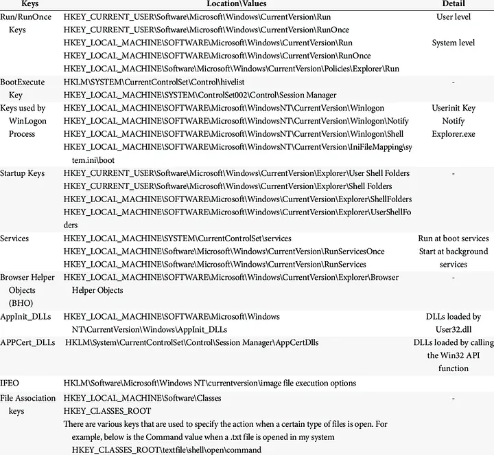
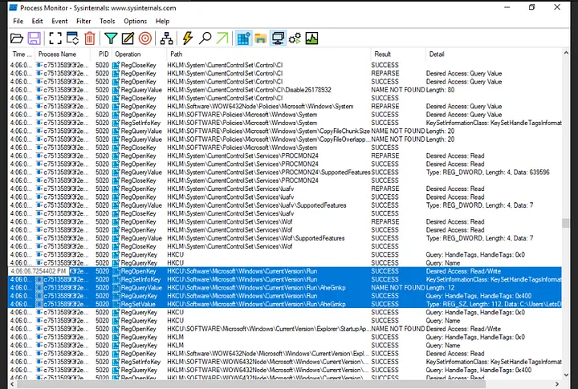
we got it "HKEY_CURRENT_USER\SOFTWARE\Microsoft\Windows\CurrentVersion\Run"

#### What is the domain name that the malware connects to for data hijacking?
>**ANSWER: us2.smtp.mailhostbox.com**
#### On which port does the malware communicate over?
>**ANSWER: 587**
#### What is the name of the executable file that the malicious application writes to the AppData directory
>**ANSWER: AheGmkp.exe**
#### Which Registry Key does the malware use to ensure persistence
>**ANSWER: HKEY_CURRENT_USER\SOFTWARE\Microsoft\Windows\CurrentVersion\Run**

# 7) Dynamic Malware Analysis Example #2


## lab
1. Lets Connect the Windows 10 virtual machine.


2. Running Process Hacker, Procmon64, Wireshark, and Fiddler tools available on the desktop before clicking on Malware file.


lets start analysing.

3. Select Ethernet in Wirshark


4. LET CAPTURE THE "CHECK IP URL"
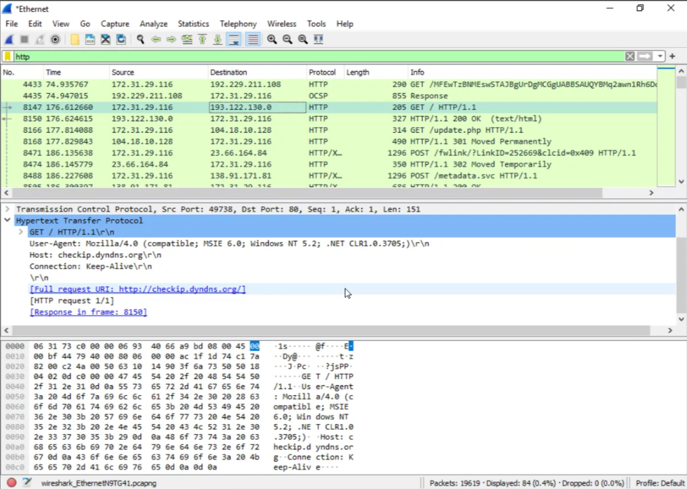
its checkip.dyndns.org

5. now to get the domain and the ip we goona use any.run
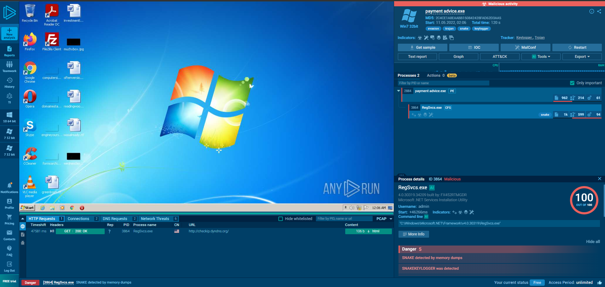

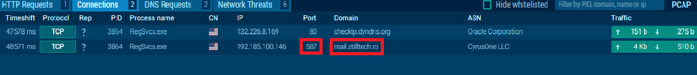
we got the domain URL and port number 

now lets do a deep research to capture the username and pass.
lets check network threads 
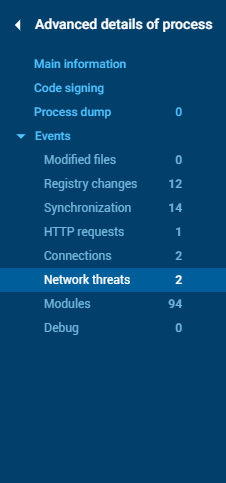

6. click on the thread -> Stream data (VIEW as TEXT) lets search now 
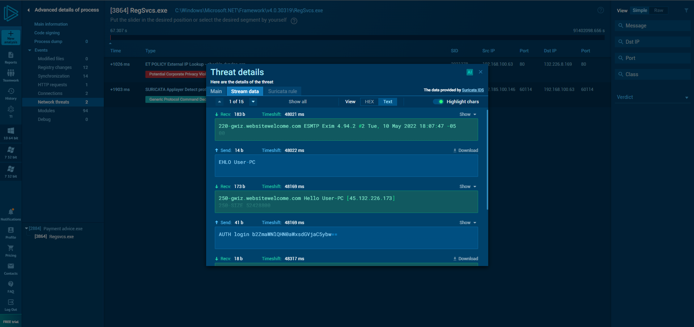

we got the username and the pass but they are encoded BASE64
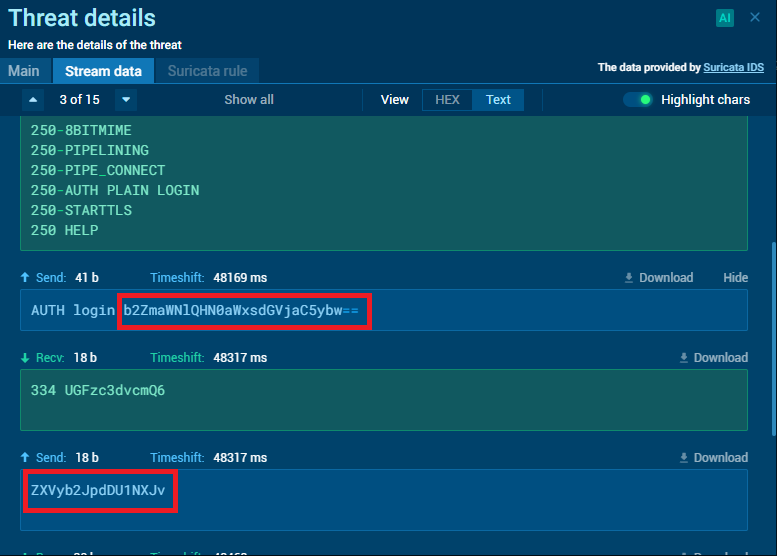

decode them and finish the lab hehehhe !!

#### What is the domain name of the web application that the malware is requesting to learn its IP address?
>**ANSWER: checkip.dyndns.org**
#### What is the domain name that the malware connects to for data hijacking?
>**ANSWER: mail.stilltech.ro**
#### What port does the malware communicate over?
>**ANSWER: 587**
#### What is the username used by the malware to authenticate to the mail server it connects for data hijacking?
>**ANSWER: office@stilltech.ro**
#### What is the password that the malware uses to authenticate to the mail server it connects for data hijacking?
>**ANSWER: eurobit555ro**


# 8) My Malware Doesn’t Do Anything?
* its maybe Wait a Little Longer
* Execute as Administrator : Most malware has the ability to terminate itself without exhibiting any malicious activity when not run at high privileges. For this reason, you can try to run a non-active malware with an authorized user.

* Change Language Settings : The malware will not run unless you have an environment with features that the malware controls. Target-oriented malware usually performs controls such as operating system information, operating system language, location information of the system via IP address, timezone information. You may need to create an environment targeted by malware to ensure that it displays malicious activities.

* Use Different Network : For example, in order to run a malicious software that is targeting France only, the attackers check whether the device is located in France or not by querying the IP address of the infected device in IP-GeoLocation services. For this reason, when your malware does not work, you can enable the device to access to the Internet through different countries IP addresses with the help of VPN tools , For example, if a malware is transmitted via an e-mail, you can try the countries where the language of the e-mail is spoken. If the e-mail is written in Spanish, you can try countries such as Spain, Mexico, Colombia, etc.

* Other Methods : 
1. Try running the malware from a different directory.
2. Change the screen resolution.
3. Perform activities on the operating system while the malware is running. (Creating different processes, moving the mouse, writing, etc.)

# 9) Quiz
#### Which of the following products is not used for virtualization?
>**ANSWER: IDA Pro**
#### What filter should be created to list file creation events in Procmon?
>**ANSWER: Operation is CreateFile**
#### Which filter should be created to list process creation events in Procmon?
>**ANSWER: Operation is Process Start**
#### Which tool would be more appropriate to use to analyze network activities?
>**ANSWER: Wireshark**
#### What types of activities are not displayed in Procmon?
>**ANSWER: Syscalls**
#### What protocol does the Fiddler tool monitor?
>**ANSWER: HTTP**
#### Which command should be entered in the "Run" application to access the directory where the applications that will start automatically when the operating system is started are stored?
>**ANSWER: shell:startup**
#### What filter should be entered to list the activities with destination port 443 on Wireshark?
>**ANSWER: tcp.dstport == 443**
#### Which of the following is an advantage of dynamic malware analysis?
>**ANSWER: Speed**
#### Which of the following is not a method used by malware to ensure persistence?
>**ANSWER: Renaming itself**


